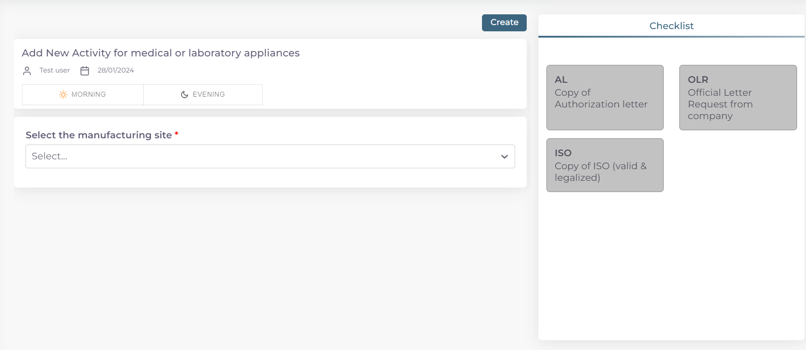
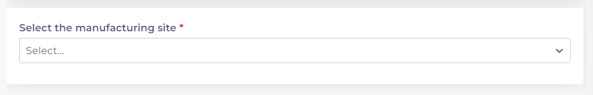
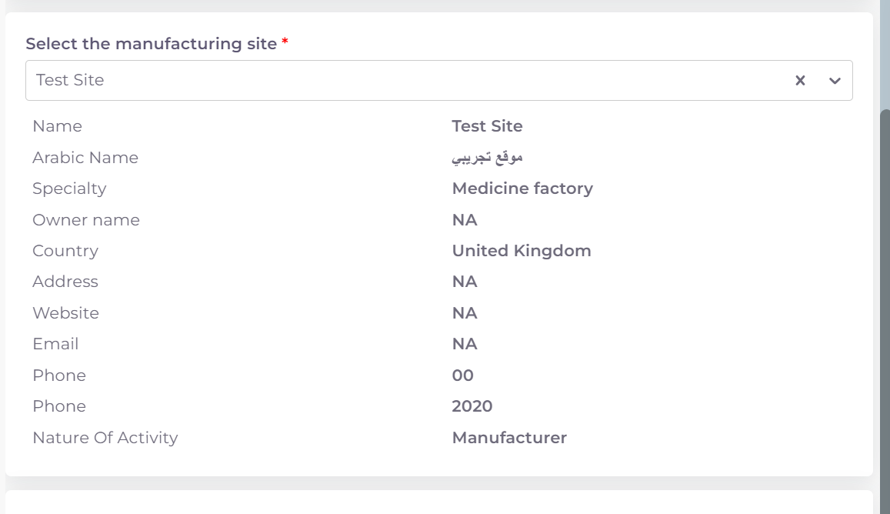
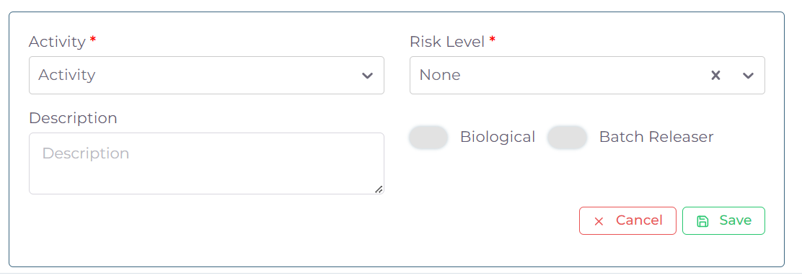
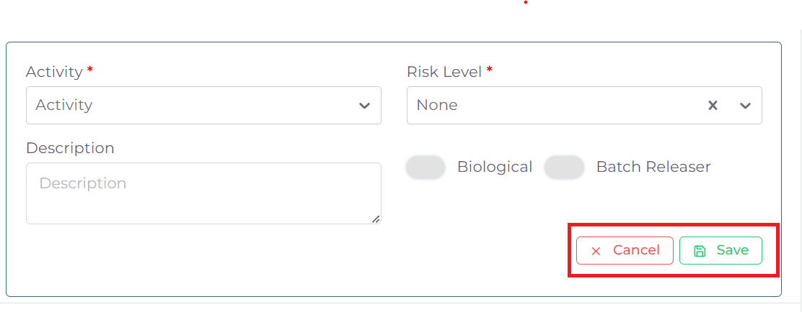
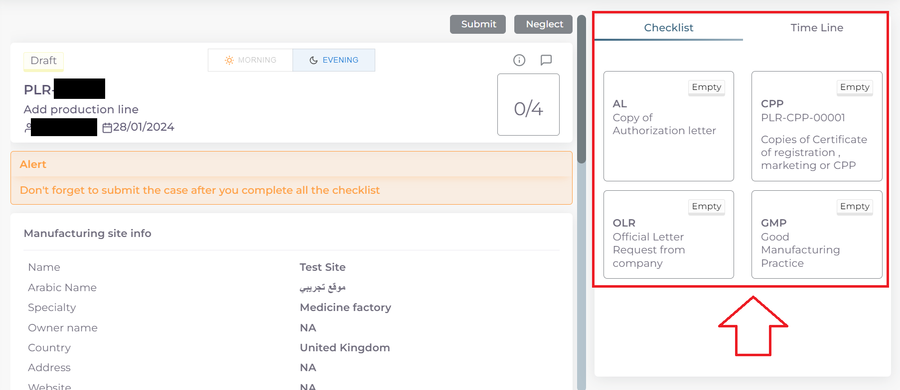
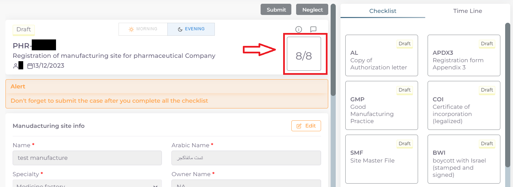
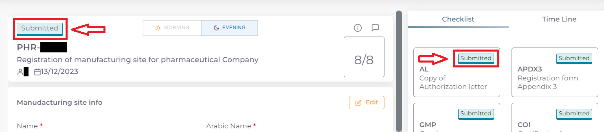

خطوات تقديم معاملة اضافة نشاط لشركة اجهزة طبية او مختبرية
==============================================================

**اولا: بدء معاملة جديدة واختيار نوع المعاملة**:

1. من واجهه الحساب الرئيسية نضغط على زر new لغرض بدء معاملة جديدة:

.. image:: ../../images/company/new-sub.png

2. ثم نختار نوع المعاملات المختصة بالمواقع التصنيعية:

.. image:: ../../images/company/comp-type.png

3. ثم نختار نوع المعاملة وهي خط انتاج:

.. image:: ../../images/company/pl-type.png

4. ثم نختار نوع المعاملة وهي اضافة نشاط لشركة اجهزة طبية او مختبرية:

.. image:: ../../images/company/pl-nae.png

**ثانيا: اختيار الموقع التصنيعي المسجل مسبقا المراد اضافة خط انتاجي له و ملئ معلومات الخط او الخطوط المضافة وبدء المعاملة**:

1. اختيار وقت تدقيق المعاملة حسب اوقات الدوام الرسمي في الوزارة:

.. image:: ../../images/company/plr-shift.png

.. note::
    الشفت المسائي: يكون وقت تدقيق المعاملة من ال 8 صباحا الى ال 5 مساءًا
    
    الشفت الصباحي: يكون وقت تدقيق المعاملة من 8 صباحا الى ال 2مساءًا

    الشفت المسائي يكون اسرع لان وقت التدقيق اليومي اكثر
    
    تكلفة التسجيل للشفت المسائي تكون اكثر من الصباحي

2. اختيار الموقع التصنيعي المراد اضافة خط انتاجي له:

3. بعد اختيار الموقع التصنيعي تضهر معلومات الموقع:

4. ثم نذهب لنهاية الصفحة لاختيار نوع الاضافة:

    1. اختيار خط انتاجي مسجل مسبقا ومربوط بالمكتب العلمي لغرض تفعيله

    .. image:: ../../images/company/pl-add-exist.png

    2.  لغرض اضافة خط انتاجي جديد للموقع التصنيعي:

    .. image:: ../../images/company/pl-add-new.png

5. بعد اختيار نوع الاضافة نقوم باختيار نوع الخط الانتاجي ومعلوماته:

وتشمل:

- نوع نشاط الخط الانتاجي Activity:

.. image:: ../../images/company/pl-activ.png

- مستوى الخطورة Risk Level:

.. image:: ../../images/company/pl-risk.png

- اذا كان المنتج حيوي فيتم تحديد الحقل Biological:

.. image:: ../../images/company/pl-bio.png

.. note::
    في حالة تفعيل خط انتاجي مسجل مسبقا ومربوط في المكتب العلمي يتم اختيار الخط فقط دون ملئ اي حقول 

6. الضغط على Save لحفظ الخط او الضغط على Cancel لاهمال الخط:

7. يمكن اضافة اكثر من خط انتاجي للمعاملة الواحدة عن طريق تكرار الخطوات السابقة

8. بعد اضافة كافة الخطوط الانتاجية المطلوبة نعود الى اعلى الصفحة ونضغط على Create لغرض بدء المعاملة:

.. image:: ../../images/company/pl-create.png

**ثالثا: ملئ قوائم متطلبات المعاملة Cheacklist**:

1. بعد بدء المعاملة نرى قسم قوائم المتطلبات Cheacklist على اليمين قد فتح الدخول له

.. note::
    لكل معاملة عدد محدد من قوائم المتطلبات Cheacklist التي يجب ملئها جميعا قبل ارسال المعاملة

    وفي حالة معاملة اضافة نشاط - شركة مستلزمات طبية او مختبرية عدد القوائم Cheacklist المطلوبة في المعاملة هي  3:

        .. image:: ../../images/company/chec-num-naa.png
    
    ويمكن ملاحظة حالة اي Checklist من خلال الركن العلوي الايمن:

        .. image:: ../../images/company/plr-chec-stat.png
    
    وتكون الحالة Empty اي لم يتم ملئ القائمة بعد.

.. note::

    وتشمل ال cheacklist في حالة معاملة اضافة نشاط لشركة اجهزة طبية او مختبرية:

    1. رسالة التخويل AL:

    .. image:: ../../images/company/AL.png

    2. رسالة الطلب الرسمية من الشركة OLR:

    .. image:: ../../images/company/olr.png

    3. شهادة ال iso:

    .. image:: ../../images/company/iso.png

.. warning::
    قبل البدء بملئ اي Cheacklist يجب مراعاة ما يلي:

    1. ملئ الحقول المطلوبة ان وجدت

    2. يجب رفع الملف الخاص في ال Cheacklist بصيغة pdf

    3. ان يكون الملف المقدم يحوي فقط اوراق الملف المخصصة لل Cheacklist

**كيفية ملئ الحقول ورفع الملفات لل Cheacklist وطريقة حفظ التقدم**:

1. نضغط على احد القوائم للبدء وتظهر صفحة القائمة :

    .. image:: ../../images/company/Cheacklist-page.png

.. note::

    يمكننا معرفة ال Cheacklist الحالية من خلال

    1. اسم ال Cheaklist:

        .. image:: ../../images/company/ch-name.png

    2. او من خلال لون الحد الخارجي للقائمة على اليمين:

        .. image:: ../../images/company/ch-shadow.png

2. نقوم بملئ الحقول المطلوبة ان وجدت:

    .. image:: ../../images/company/field-save.png

3. ثم نقوم بحفظ معلومات الحقول بعد ملئ كل الحقول المطلوبة عن طريق الضغط على زر Save Info:

    .. image:: ../../images/company/field.png

.. note::

    في حالة حدوث خطأ في ادخال المعلومات وتم حفظ التقدم فيمكن التعديل على الحقول عن طريق الضغط على Edit:

        .. image:: ../../images/company/edit.png
    
    ثم تغيير الحقول المطلوبة والضغط على Save Info لحفظ التغييرات الجديدة او الضغط على Cancel لتجاهل التغييرات

        .. image:: ../../images/company/cancel-save.png

4. والان نقوم برفع الملف الخاص بهذة القائمة عن طريق النزول لقسم Attachments في اخر الصفحة :

    .. image:: ../../images/company/attach.png

5. نقوم بالضغط على ايقونة الرفع واختيار ملف للرفع:

    .. image:: ../../images/company/upload.png

6. ويضهر الملف بعد رفعه كما موضح ادناه:

    .. image:: ../../images/company/upload-show.png

    .. note::

         في حالة رغبتك بالتاكد من الملف فيمكنك عرض الملف المرفوع عن طريق الضغط على الايقونة رقم 1.
         
         واذا اردت تنزيل الملف نضغط على الايقونة رقم 2 .
         
         واذا اردت حذف الملف فنضغط على الايقونة رقم 3 .
         
         واذا اردت اضافة ملاحظة حول الملف نضغط الايقونة رقم 4 :
         
        .. image:: ../../images/company/folder-icon.png

7. بعد رفع الملف وملئ الحقول ان وجدت نعود الى بداية الصفحة ونضغط على save لغرض حفظ ال cheacklist :

.. image:: ../../images/company/save-chck.png

.. note::
    بعد حفظ تقدم ال cheacklist نلاحظ تغيير حالة ال cheacklist الى Draft وتعني ان القائمة تم ملئ حقولها  وتم رفع الملف ايضا, ونلاحظ ايضا زيادة موشر ال cheacklist بمقدار 1 وتعني انه تم ملئ ال cheacklist وحفظ التقدم بنجاح :

    .. image:: ../../images/company/cheack-ch.png

8. نقوم بملئ كل ال Cheacklist باستخدام نفس الطريقة

9. بعد ملئ كافة ال Cheacklist وتحول حاتهم الى  Draft يمكننا ملاحظة عدد ال Cheacklist التي تم ملئهى قد اكتمل:

10. بعد تدقيق المعلومات والملفات المرفوعة يمكن الان ارسال المعاملة الى الجهات المختصة لمراجعتها:

.. warning::
    لا يمكن تعديل اي حقول او ملفات بعد ارسال المعاملة لذلك يرجى التاكد جيدا قبل الارسال.
    وفي حال حدوث اي خطأ يرجى التواصل مع قسم الدعم الفني لتلقي المساعدة اللازمة

11. نضغط على زر Submit  في واجهه المعاملة الرئيسية لغرض ارسال المعاملة:

.. image:: ../../images/company/submit.png

.. warning::
    في حالة وجود خطأ في اختيار نوع المعاملة او شيئ مشابه يمكن اهمال المعاملة الحالية عن طريق الضغط على زر Neglect:

    .. image:: ../../images/company/neglict.png

.. note::
    للانتقال من واجهه ال احد ال Cheacklist الى واجهه المعاملة الرئيسية نضغط على زر ال Back:

    .. image:: ../../images/company/back.png

12. لتاكيد عملية الارسال نرى حالة المعاملة الرئيسية وحالة كل Cheaklist  قد تحولت الى Submitted اي تم الارسال بنجاح:

13. بعد الانتهاء من الارسال يجب مراجعة شعبة العلاقات في وزارة الصحة مع جلب الملفات المصدقة والاصلية المطلوبة حسب تعليمات الوزارة وايضا لدفع فاتورة الاستمارة الالكترونية.

