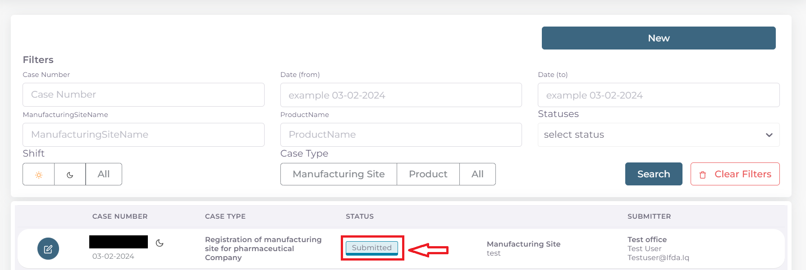

متابعة حالة المعاملة بعد التقديم
===================================

بعد اتمام ارسال المعاملة بنجاح سستحول حالة المعاملة الرئيسية الى Submitted ويمكن رؤية حالة المعاملة المقدمة من واجهه الحساب الرئيسية:

**مراحل تدقيق المعاملة وصولا الى التسجيل**:

#. بعد ارسال المعاملة يجب الذهاب الى شعبة العلاقات في الطابق الخامس من وزارة الصحة لتسليم الوثائق الرسمية بشكل ورقي واستلام وصل التقديم الالكتروني

بعد تسليم الوثائق واتمام دفع رسوم التقديم الالكتروني وبعد اتمام استلام المعاملة من قبل الشعبة المختصة تتحول حالة المعاملة من Submitted الى 

.. image:: ../images/company/
