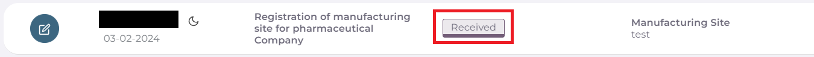
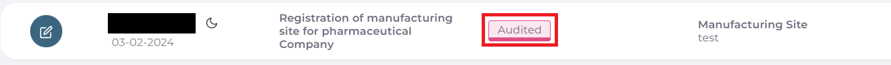
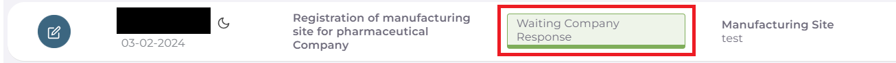
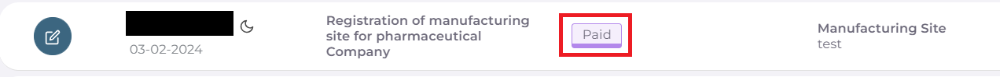
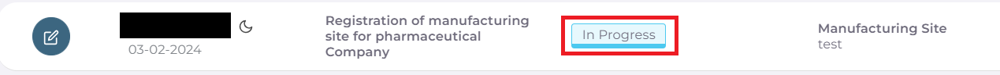
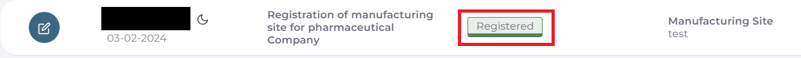

متابعة حالة المعاملة بعد التقديم
===================================

بعد اتمام ارسال المعاملة بنجاح سستحول حالة المعاملة الرئيسية الى Submitted ويمكن رؤية حالة المعاملة المقدمة من واجهه الحساب الرئيسية:

.. image:: ../images/company/case-status.png

**مراحل تدقيق المعاملة وصولا الى التسجيل**:

1. بعد ارسال المعاملة يجب الذهاب الى شعبة العلاقات في الطابق الخامس من وزارة الصحة لتسليم الوثائق الرسمية بشكل ورقي واستلام وصل التقديم الالكتروني

بعد تسليم الوثائق واتمام دفع رسوم التقديم الالكتروني وبعد اتمام استلام المعاملة من قبل شعبة العلاقات تتحول حالة المعاملة من Submitted الى Received. 

2. ثم يتم تحويل المعاملة الى قسم التدقيق ليتم تدقيق المعاملة والملفات المرفوعة والمعلومات لكل Checklist.

في حالة قبول وتاكيد صحة المعلومات والملفات من قبل لجنة التدقيق يتم تحويل حالة المعاملة الى Audited.

.. note::
    عند تغير حالة المعاملة الرئيسية الى Audited تعني ان المعلومات الرئيسية ومعلومات كل ال Checklist تم تدقيقها والموافقة عليها بنجاح.

    .. image:: ../images/company/AuditedAll.png

في حالة وجود خطأ او نقص في اي من ال Checklist يتم تحويل حالة المعاملة الى Waiting Company Response وتعني ان هنالك نقص ويجب على المكتب العلمي رفع النقوصات وتعديل الملفات المقدمة.

.. note::
    لمعرفة كيفية الرد على قرار المتطلبات او النواقص يمكن زيارة :doc:`response` .

3. بعد الانتهاء من لجنة التدقيق وتحول حالة المعاملة الى Audited ياتي الان دور عملية دفع رسوم المعاملة.

وبعد مراجعة شعبة العلاقات واستلام الوصولات والوثائق المطلوبة واتمام عملية دفع الرسوم يتم تحويل حالة المعاملة من Audited الى Paid وذلك يعني تمام عملية الدفع بنجاح.

4. بعد اتمام عملية دفع الرسوم يتم تحويل المعاملة الى قسم التسجيل لغرض التدقيق النهائي وتجهيز المعاملة لغرض الدخول الى جلسة الاقرار.

ويتم تحويل حالة المعاملة من Paid الى In Progress وتعني ان قسم التسجيل قد استلم وبدء بمراحل التدقيق النهائي للمعاملة.

5. في حال عبور المعاملة للتدقيق النهائي لقسم التسجيل وتاكيد صحة معلومات المعاملة والملفات لكل ال Checklist تكون المعاملة جاهزة للدخول الى جلسة الاقرار.

يتم تحويل المعاملة من In Progress الى Ready For Session.

في حالة وجود نقص او طلب المزيد من المعلومات يتم تحويل حالة المعاملة من In Progress الى Require Company Response.

.. note::
    لمعرفة كيفية الرد على قرار المتطلبات او النواقص يمكن زيارة :doc:`response`.

6. وتكون المعاملة في حالة Ready For Session جاهزة للدخول الى الجلسة.

بعد دخول المعاملة الى الجلسة يتم تحويل حالة المعاملة الى In Session اي ان المعاملة داخل جلسة حاليا.

7. في حالة انتهاء الجلسة وقبول المعاملة يتم تحويل حالة المعاملة الى Registered او Re-Register حسب نوع المعاملة 

اي انه تم اقرار التسجيل او اعادة التسجيل بنجاح.

وفي حالة رفض المعاملة من قبل اللجان داخل الجلسة يتم تحويل حالة المعاملة الى Rejected.

