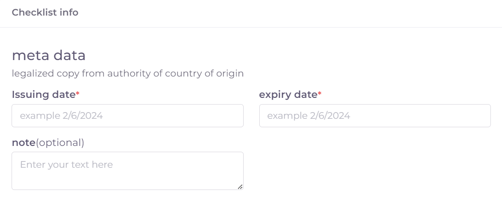
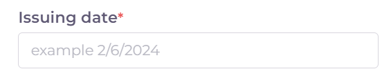
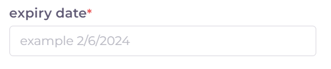
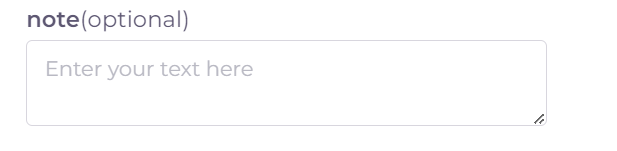

خطوات تقديم معاملة تسجيل موقع تصنيعي لشركة دوائية PHR 
=========================================================

**اولا: بدء معاملة جديدة واختيار نوع المعاملة**:

1. من واجهه الحساب الرئيسية نضغط على زر new لغرض بدء معاملة جديدة:

.. image:: ../images/company/new-sub.png

2. ثم نختار نوع المعاملات المختصة بالمواقع التصنيعية:

.. image:: ../images/company/comp-type.png

3. ثم نختار نوع المعاملة وهي تسجيل موقع تصنيعي جديد:

.. image:: ../images/company/rigester-type.png

4. ثم نختار تخصص الموقع التصنيعي و هو تسجيل موقع تصنيعي لشركة ادوية:

.. image:: ../images/company/sub-types.png

**ثانيا: ملئ المعلومات الاساسية للموقع التصنيعي وبدء المعاملة**:

.. image:: ../images/company/comp-info.png

.. note::
    اي حقل عليه علامة * هو حقل اجباري ويجب ملؤه للتقدم في المعاملة

    واي حقل لا يحوي هذه العلامة او يحوي على كلمة Optional فهو حقل اختياري يمكن تركه او ملؤه ولا يوثر على التقدم في المعاملة

1. اختيار وقت تدقيق المعاملة:

.. image:: ../images/company/shift.png

2. ثم نكتب اسم الموقع التصنيعي: 

.. image:: ../images/company/comp-names.png

.. note::
    حقل ال Name يكتب به اسم الموقع التصنيعي الموجود في الوثائق

    اما حقل ال Arabic Name يكتب به اللفظ العربي للاسم

    مثلا: اذا كان اسم الشركة في الوثائق هو astrazeneca فيكتب في حقل ال Name

    اما في حقل ال Arabic Name فنكتب استرازنيكا وحسب اللفظ العربي الصحيح

3. اختيار تخصص الموقع التصنيعي:

.. image:: ../images/company/sprc-phr.png

.. note::
    في حالة هذة المعاملة هنالك نوعين من التخصصات:

    1. مصنع مستحضرات طبية Medicine factory

    \

    2. مصنع لقاحات Vaccine factory

4. اسم الشخص المالك للموقع:

.. image:: ../images/company/boss.png

.. note::
    اذا لم تتوفر هذة المعلومة في ملفات الموقع فيكتب NA في الحقل 

5. ملئ معلومات عنوان الموقع ومعلومات التواصل وسنة التأسيس للموقع التصنيعي:

.. image:: ../images/company/info-address.png

.. attention::
    اختيار الدولة سيوثر مستقبلا على وجود احد المتطلبات Cheacklist وهية رسالة الدعوة INVT 
    
    في حالة اختيار دولة من الفئة A لا يطلب ملف الزيارة
    
    اما في حالة دولة من الفئة B او OTHER فيتم طلب دعوة الزيارة

6. ثم نعود الى بداية الصفحة ونضغط على Create لغرض بدء المعاملة:

.. image:: ../images/company/create.png

7. فيتم انشاء معاملة في النظام الالكتروني كما موضح ادناه:

.. image:: ../images/company/phr-create.png

**ثالثا: ملئ قوائم متطلبات المعاملة Cheacklist**:

1. بعد بدء المعاملة والضغط على Create  يستطيع المكتب العلمي المباشرة بملئ متطلبات المعاملة Cheacklist. 

.. image:: ../images/company/checklist-home.png

.. warning::
    قبل البدء بملئ اي Cheacklist يجب مراعاة ما يلي:

    1. ملئ الحقول المطلوبة ان وجدت

    2. يجب رفع الملف الخاص في ال Cheacklist بصيغة pdf

    3. ان يكون الملف المقدم يحوي فقط اوراق الملف المخصصة لل Cheacklist

**كيفية ملئ الحقول ورفع الملفات لل Cheacklist وطريقة حفظ التقدم**:

1. نضغط على احد المتطلبات للبدء بملؤها وتشمل :

1. رسالة التخويل Authorization letter: ويجب ان تكون نسخة مصدقة وقانونية صادرة من دولة الموقع التصنيعي:

**نقوم اولا بملئ حقول ال Checklist**

.. note::
    اي حقل يحوي على علامة * فهو حقل يجب ملؤه

    اما اذا لم يحوي على العلامة او كان يحوي على كلمة Optional فهو حقل اختياري

**وتشمل الحقول:**

1. تاريخ اصدار رسالة التخويل Issuing Date:

2. تاريخ انتهاء رسالة التخويل Expiry Date:

3. حقل ملاحظات اختياري Note:

4. ثم نقوم بحفظ معلومات الحقول بعد ملئ كل الحقول المطلوبة عن طريق الضغط على زر Save Info في بداية الصفحة:

    .. image:: ../images/company/field.png

.. note::

    في حالة حدوث خطأ في ادخال المعلومات وتم حفظ التقدم فيمكن التعديل على الحقول عن طريق الضغط على Edit:

        .. image:: ../images/company/edit.png
    
    ثم تغيير الحقول المطلوبة والضغط على Save Info لحفظ التغييرات الجديدة او الضغط على Cancel لتجاهل التغييرات

        .. image:: ../images/company/cancel-save.png

**نقوم برفع الملف (ويجب ان يكون بصيغة pdf)**:
  

1. لكي نقوم برفع الملف الخاص بهذة القائمة نقوم بالنزول لقسم Attachments في اخر الصفحة :

    .. image:: ../images/company/attach.png

2. نقوم بالضغط على ايقونة الرفع واختيار ملف للرفع (يجب ان يكون الملف بصيغة pdf):

    .. image:: ../images/company/upload.png

3. ويضهر الملف بعد رفعه كما موضح ادناه:

    .. image:: ../images/company/upload-show.png

    .. note::

         في حالة رغبتك بالتاكد من الملف فيمكنك عرض الملف المرفوع عن طريق الضغط على الايقونة رقم 1.
         
         واذا اردت تنزيل الملف نضغط على الايقونة رقم 2 .
         
         واذا اردت حذف الملف فنضغط على الايقونة رقم 3 (لا يمكن تعديل او حذف الملف بعد ارسال المعاملة).
         
         واذا اردت اضافة ملاحظة حول الملف نضغط الايقونة رقم 4 :
         
        .. image:: ../images/company/folder-icon.png

**حفظ ال Cheacklist**

بعد رفع الملف وملئ الحقول ان وجدت نعود الى بداية الصفحة ونضغط على save لغرض حفظ ال cheacklist :

.. image:: ../images/company/save-chck.png

10. بعد ملئ كافة ال Cheacklist وتحول الحالة الى  Draft يمكن الان ارسال المعاملة وعمل Submit:

.. warning::
    لا يمكن تعديل اي حقول او ملفات بعد ارسال المعاملة لذلك يرجى التاكد جيدا قبل الارسال.
    وفي حال حدوث اي خطأ يرجى التواصل مع قسم الدعم الفني لتلقي المساعدة اللازمة

12. نضغط على زر Submit  في واجهه المعاملة الرئيسية لغرض ارسال المعاملة:

.. image:: ../images/company/submit.png

.. warning::
    في حالة وجود خطأ في اختيار نوع المعاملة او شيئ مشابه يمكن اهمال المعاملة الحالية عن طريق الضغط على زر Neglect:

13. لتاكيد عملية الارسال نرى حالة المعاملة الرئيسية وحالة كل Cheaklist  قد تحولت الى Submitted اي تم الارسال بنجاح:

.. image:: ../images/company/f-submit.png

14. بعد الانتهاء من الارسال يجب مراجعة وزارة الصحة/ دائرة الامور الفنية/ قسم التسجيل  مع جلب الملفات المصدقة والاصلية المطلوبة وايضا لدفع فاتورة الاستمارة الالكترونية.

