خطوات تقديم معاملة تسجيل موقع تصنيعي لشركة دوائية PHR 
=========================================================

**اولا: بدء معاملة جديدة واختيار نوع المعاملة**:

1. من واجهه الحساب الرئيسية نضغط على زر new لغرض بدء معاملة جديدة:

.. image:: ../images/company/new-sub.png

2. ثم نختار نوع المعاملات المختصة بالمواقع التصنيعية:

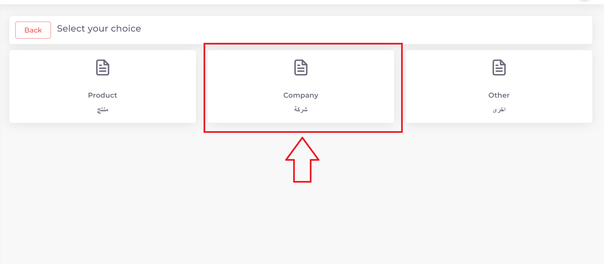

3. ثم نختار نوع المعاملة وهي تسجيل موقع تصنيعي جديد:

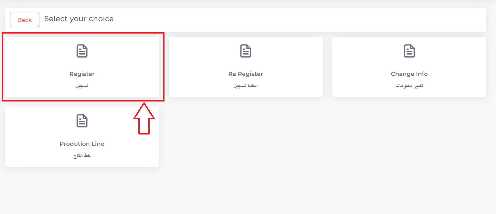

4. ثم نختار تخصص الموقع التصنيعي وهوة تسجيل موقع تصنيعي لشركة ادوية:

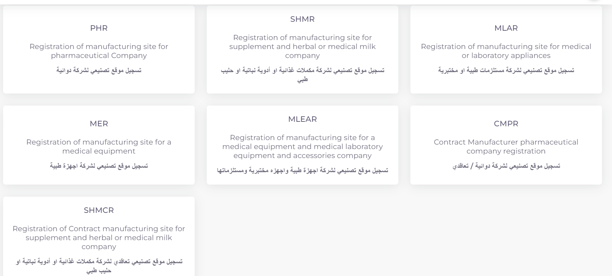

**ثانيا: ملئ المعلومات الاساسية للموقع التصنيعي وبدء المعاملة**:

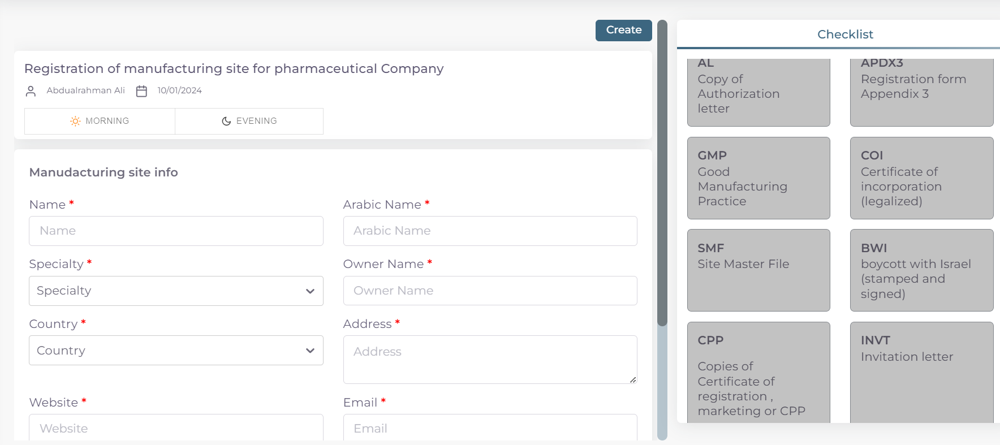

.. note::
    اي حقل عليه علامة * هوة حقل اجباري ويجب ملئه للتقدم في المعاملة

    واي حقل لا يحوي هذه العلامة او يحوي على كلمة Optional فهوة حقل اختياري يمكن تركه او ملئه ولا يوثر على التقدم في المعاملة

1. اختيار وقت تدقيق المعاملة حسب اوقات الدوام الرسمي في الوزارة:

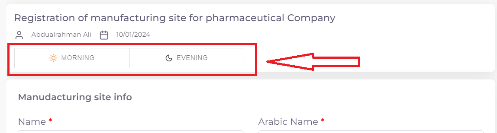

.. note::
    الشفت المسائي: يكون وقت تدقيق المعاملة من ال 8 صباحا الى ال 5 مسائا
    
    الشفت الصباحي: يكون وقت تدقيق المعاملة من 8 صباحا الى ال 2 مسائا

    الشفت المسائي يكون اسرع لان وقت التدقيق اليومي اكثر
    
    تكلفة التسجيل للشفت المسائي تكون اكثر من الصباحي

2. ثم نكتب اسم الموقع التصنيعي: 

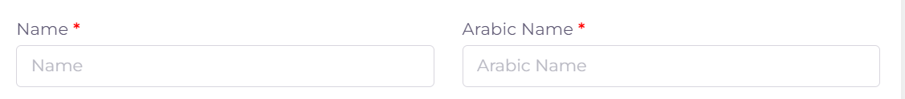

.. note::
    حقل ال Name يكتب به اسم الموقع التصنيعي الموجود في الوثائق

    اما حقل ال Arabic Name يكتب به اللفظ العربي للاسم

    مثلا: اذا كان اسم الشركة في الوثائق هوة astrazeneca فيكتب في حقل ال Name

    اما في حقل ال Arabic Name فنكتب استرازنيكا وحسب اللفظ العربي الصحيح

3. اختيار تخصص الموقع التصنيعي:

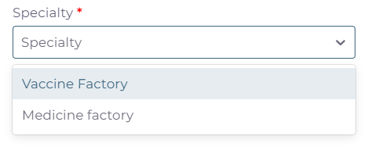

.. note::
    في حالة هذة المعاملة هنالك نوعين من التخصصات:

    1. مصنع مستحضرات طبية Medicine factory

    \

    2. مصنع لقاحات Vaccine factory

4. اسم الشخص المالك للموقع:

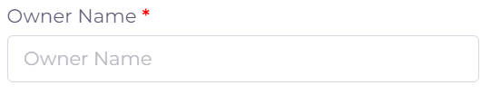

.. note::
    اذا لم تتوفر هذة المعلومة في ملفات الموقع فيكتب NA في الحقل 

5. ملئ معلومات عنوان الموقع ومعلومات التواصل وسنة التأسيس للموقع التصنيعي:

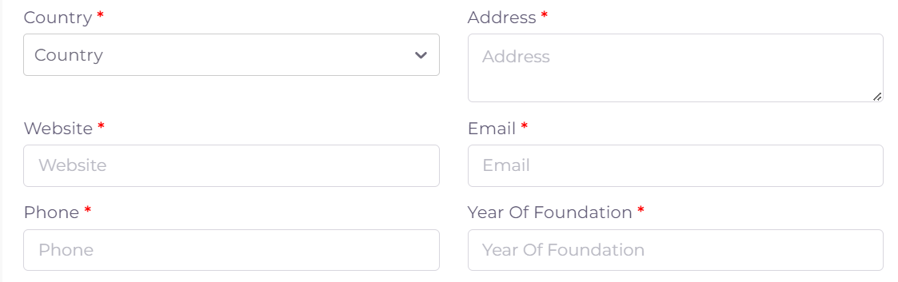

.. warning::
    اختيار الدولة سيوثر مستقبلا على وجود احد المتطلبات Cheacklist وهية رسالة الدعوة INVT 
    
    في حالة اختيار دولة من الفئة A لا يطلب ملف الزيارة
    
    اما في حالة دولة من الفئة B او OTHER فيتم طلب ملف الزيارة

6. اختيار طبيعة الموقع التصنيعي

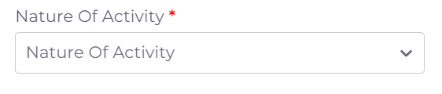

.. note::

    طبيعة الموقع اذا كان هوة:

    المصنع للمنتج Manfacture 
    

    كلاهما Manfacture and Contract manfacture

7. ثم نعود الى بداية الصفحة ونضغط على Create لغرض بدء المعاملة:

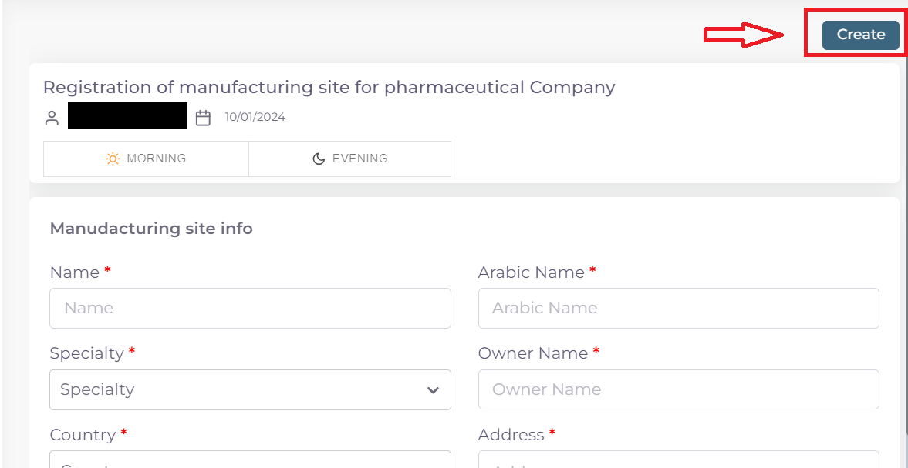

8. فيتم بدء المعاملة كما موضح ادناه:

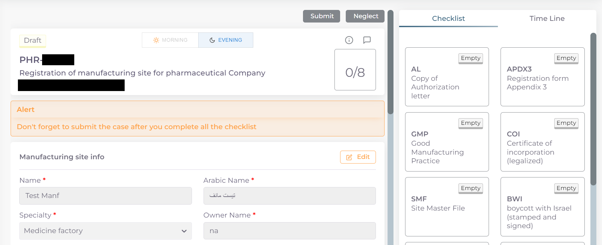

**ثالثا: ملئ قوائم متطلبات المعاملة Cheacklist**:

1. بعد بدء المعاملة نرى قسم قوائم المتطلبات Cheacklist على اليمين قد فتح الدخول له

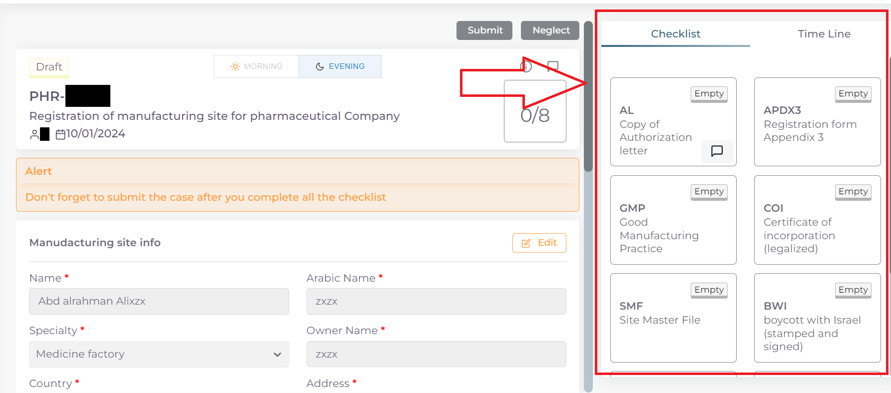

.. note::
    لكل معاملة عدد محدد من قوائم المتطلبات Cheacklist التي يجب ملئها جميعا قبل ارسال المعاملة

    وفي حالة معاملة تسجيل موقع تصنيعي دوائي عدد القوائم Cheacklist المطلوبة في المعاملة هي  8:

        .. image:: ../images/company/check-number.png
    
    ويمكن ملاحظة حالة اي Checklist من خلال الركن العلوي الايمن:

        .. image:: ../images/company/ch-status.png
    
    وتكون الحالة Empty اي لم يتم ملئ القائمة بعد.

.. note::

    وتشمل ال cheacklist في حالة معاملة تسجيل موقع تصنيعي دوائي:

    1. رسالة التخويل AL:

    .. image:: ../images/company/AL.png
    
    2. استمارة التسجيل APDX3:

    .. image:: ../images/company/APDX3.png
    
    3. شهادة التصنيع الجيد GMP:

    .. image:: ../images/company/GMP.png
    
    4. شهادة التأسيس COI:

    .. image:: ../images/company/COI.png

    5. ملف الشركة الرئيسي SMF:

    .. image:: ../images/company/SMF.png

    6. ملف المقاطعة BWI:

    .. image:: ../images/company/BWI.png

    7. شهادة المستحضر CPP:

    .. image:: ../images/company/CPP.png
    
    8. رسالة الزيارة INVT:

    .. image:: ../images/company/INVT.png

.. warning::
    قبل البدء بملئ اي Cheacklist يجب مراعاة ما يلي:

    1. ملئ الحقول المطلوبة ان وجدت

    2. يجب رفع الملف الخاص في ال Cheacklist بصيغة pdf

    3. ان يكون الملف المقدم يحوي فقط اوراق الملف المخصصة لل Cheacklist

**كيفية ملئ الحقول ورفع الملفات لل Cheacklist وطريقة حفظ التقدم**:

1. نضغط على احد القوائم للبدء وتظهر صفحة القائمة :

    .. image:: ../images/company/Cheacklist-page.png

.. note::

    يمكننا معرفة ال Cheacklist الحالية من خلال

    1. اسم ال Cheaklist:

        .. image:: ../images/company/ch-name.png

    2. او من خلال لون الحد الخارجي للقائمة على اليمين:

        .. image:: ../images/company/ch-shadow.png

3. نقوم بملئ الحقول المطلوبة ان وجدت:

    .. image:: ../images/company/field-save.png

4. ثم نقوم بحفظ معلومات الحقول بعد ملئ كل الحقول المطلوبة عن طريق الضغط على زر Save Info:

    .. image:: ../images/company/field.png

.. note::

    في حالة حدوث خطأ في ادخال المعلومات وتم حفظ التقدم فيمكن التعديل على الحقول عن طريق الضغط على Edit:

        .. image:: ../images/company/edit.png
    
    ثم تغيير الحقول المطلوبة والضغط على Save Info لحفظ التغييرات الجديدة او الضغط على Cancel لتجاهل التغييرات

        .. image:: ../images/company/cancel-save.png

5. والان نقوم برفع الملف الخاص بهذة القائمة عن طريق النزول لقسم Attachments في اخر الصفحة :

    .. image:: ../images/company/attach.png

6. نقوم بالضغط على ايقونة الرفع واختيار ملف للرفع:

    .. image:: ../images/company/upload.png

7. ويضهر الملف بعد رفعه كما موضح ادناه:

    .. image:: ../images/company/upload-show.png

    .. note::

         في حالة رغبتك بالتاكد من الملف فيمكنك عرض الملف المرفوع عن طريق الضغط على الايقونة رقم 1.
         
         واذا اردت تنزيل الملف نضغط على الايقونة رقم 2 .
         
         واذا اردت حذف الملف فنضغط على الايقونة رقم 3 .
         
         واذا اردت اضافة ملاحظة حول الملف نضغط الايقونة رقم 4 :
         
        .. image:: ../images/company/folder-icon.png

8. بعد رفع الملف وملئ الحقول ان وجدت نعود الى بداية الصفحة ونضغط على save لغرض حفظ ال cheacklist :

.. image:: ../images/company/save-chck.png

.. note::
    بعد حفظ تقدم ال cheacklist نلاحظ تغيير حالة ال cheacklist الى Draft وتعني ان القائمة تم ملئ حقولها  وتم رفع الملف ايضا, ونلاحظ ايضا زيادة موشر ال cheacklist بمقدار 1 وتعني انه تم ملئ ال cheacklist وحفظ التقدم بنجاح :

    .. image:: ../images/company/cheack-ch.png

9. نقوم بملئ كل ال Cheacklist باستخدام نفس الطريقة

10. بعد ملئ كافة ال Cheacklist وتحول حاتهم الى  Draft يمكننا ملاحظة عدد ال Cheacklist التي تم ملئهى قد اكتمل:

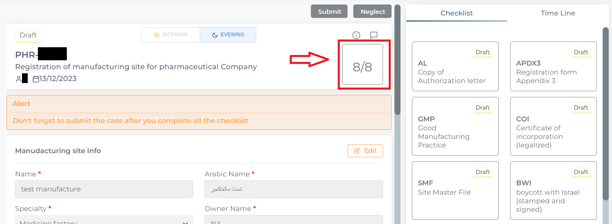

11. بعد تدقيق المعلومات والملفات المرفوعة يمكن الان ارسال المعاملة الى الجهات المختصة لمراجعتها:

.. warning::
    لا يمكن تعديل اي حقول او ملفات بعد ارسال المعاملة لذلك يرجى التاكد جيدا قبل الارسال.
    وفي حال حدوث اي خطأ يرجى التواصل مع قسم الدعم الفني لتلقي المساعدة اللازمة

12. نضغط على زر Submit  في واجهه المعاملة الرئيسية لغرض ارسال المعاملة:

.. image:: ../images/company/submit.png

.. warning::
    في حالة وجود خطأ في اختيار نوع المعاملة او شيئ مشابه يمكن اهمال المعاملة الحالية عن طريق الضغط على زر Neglect:

    .. image:: ../images/company/neglict.png

.. note::
    للانتقال من واجهه ال احد ال Cheacklist الى واجهه المعاملة الرئيسية نضغط على زر ال Back:

    .. image:: ../images/company/back.png

13. لتاكيد عملية الارسال نرى حالة المعاملة الرئيسية وحالة كل Cheaklist  قد تحولت الى Submitted اي تم الارسال بنجاح:

.. image:: ../images/company/f-submit.png

14. بعد الانتهاء من الارسال يجب مراجعة شعبة العلاقات في وزارة الصحة مع جلب الملفات المصدقة والاصلية المطلوبة حسب تعليمات الوزارة وايضا لدفع فاتورة الاستمارة الالكترونية.

