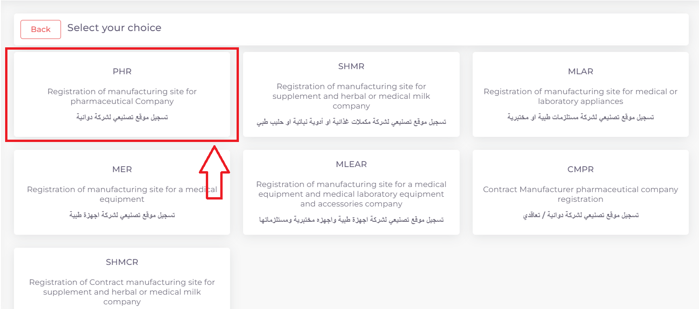
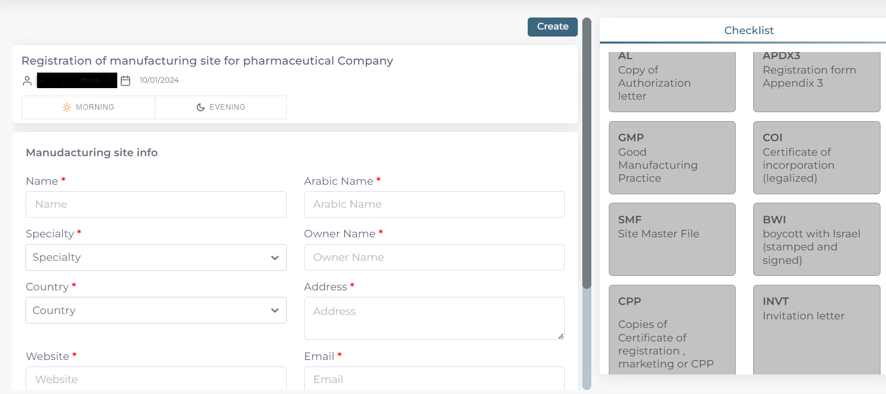
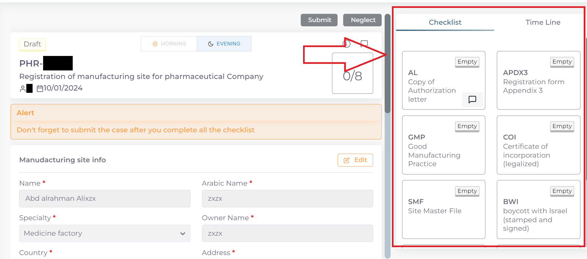

معاملات تسجيل
=============

**اولا: بدء معاملة جديدة واختيار نوع المعاملة**:

1. من واجهه الحساب الرئيسية نضغط على زر new لغرض بدء معاملة جديدة:

.. image:: ../images/company/new-sub.png

2. ثم نختار نوع المعاملات المختصة بالمواقع التصنيعية:

.. image:: ../images/company/comp-type.png

3. ثم نختار نوع المعاملة وهي تسجيل موقع تصنيعي جديد:

.. image:: ../images/company/rigester-type.png

4. ثم نختار تخصص الموقع التصنيعي المراد تسجيله:

**ثانيا: ملئ المعلومات الاساسية للموقع التصنيعي وبدء المعاملة**:

.. note::
    اي حقل عليه علامة * هوة حقل اجباري ويجب ملئه للتقدم في المعاملة

    واي حقل لا يحوي هذه العلامة او يحوي على كلمة Optional فهوة حقل اختياري يمكن تركه او ملئه ولا يوثر على التقدم في المعاملة

1. اختيار وقت تدقيق المعاملة حسب اوقات الدوام الرسمي في الوزارة:

.. image:: ../images/company/shift.png

.. note::
    الشفت المسائي: يكون وقت تدقيق المعاملة من ال 8 صباحا الى ال 5 مسائا
    
    الشفت الصباحي: يكون وقت تدقيق المعاملة من 8 صباحا الى ال 2 مسائا

    الشفت المسائي يكون اسرع لان وقت التدقيق اليومي اكثر
    
    تكلفة التسجيل للشفت المسائي تكون اكثر من الصباحي

2. ثم نكتب اسم الموقع التصنيعي: 

.. image:: ../images/company/comp-names.png

.. note::
    حقل ال Name يكتب به اسم الموقع التصنيعي الموجود في الوثائق

    اما حقل ال Arabic Name يكتب به اللفظ العربي للاسم

    مثلا: اذا كان اسم الشركة في الوثائق هوة astrazeneca فيكتب في حقل ال Name

    اما في حقل ال Arabic Name فنكتب استرازنيكا وحسب اللفظ العربي الصحيح

3. اختيار تخصص الموقع التصنيعي:

4. اسم الشخص المالك للموقع:

.. image:: ../images/company/boss.png

.. note::
    اذا لم تتوفر هذة المعلومة في ملفات الموقع فيكتب NA في الحقل 

5. ملئ معلومات عنوان الموقع ومعلومات التواصل وسنة التأسيس للموقع التصنيعي:

.. image:: ../images/company/info-address.png

6. اختيار طبيعة الموقع التصنيعي

.. image:: ../images/company/nature.png

.. note::

    Manfacture وتعني طبيعة الموقع اذا كان هوة المصنع للمنتج
    
    او تعاقدي Contract manfacture

    Manfacture and Contract manfacture او كلاهما

7. ثم نعود الى بداية الصفحة ونضغط على Create لغرض بدء المعاملة:

.. image:: ../images/company/create.png

8. فيتم بدء المعاملة كما موضح ادناه:

.. image:: ../images/company/phr-create.png

.. note::
    الصورة اعلاه هية مثال لموقع تصنيعي دوائي وقد ترى عدة اختلافات لديك في الاسم وعدد القوائم حسب نوع الموقع

    ونلاحظ ايضا تغيير حالة المعاملة الى Draft اي انه تم بدء المعاملة لغرض اكمال ملئ المعلومات الباقية

    .. image:: ../images/company/phr-status.png

**ثالثا: ملئ قوائم متطلبات المعاملة Cheacklist**:

1. بعد بدء المعاملة نرى قسم قوائم المتطلبات Cheacklist على اليمين قد فتح الدخول له

.. note::
    لكل معاملة عدد محدد من قوائم المتطلبات Cheacklist التي يجب ملئها جميعا قبل ارسال المعاملة

    وفي حالة المثال اعلاه عدد القوائم Cheacklist المطلوبة في المعاملة هي 8

        .. image:: ../images/company/check-number.png
    
    ويمكن ملاحظة حالة اي Checklist من خلال الركن العلوي الايمن

        .. image:: ../images/company/ch-status.png
    
    وتكون الحالة Empty اي لم يتم ملئ القائمة بعد

.. warning::
    قبل البدء بملئ اي Cheacklist يجب مراعاة ما يلي:

    1. ملئ الحقول المطلوبة ان وجدت

    2. يجب رفع الملف الخاص في ال Cheacklist بصيغة pdf

    3. يجب ان يكون المف المرفوع مختوما ورسميا

    4. ان يكون الملف المقدم يحوي فقط اوراق الملف المخصصة لل Cheacklist

2. نضغط على احد القوائم للبدء وتضهر صفحة القائمة :

    .. image:: ../images/company/Cheacklist-page.png

.. note::

    يمكننا معرفة ال Cheacklist الحالية من خلال

    1. اسم ال Cheaklist:

        .. image:: ../images/company/ch-name.png

    2. او من خلال لون الحد الخارجي للقائمة على اليمين:

        .. image:: ../images/company/ch-shadow.png

3. نقوم بملئ الحقول المطلوبة:

    .. image:: ../images/company/field-save.png

4. ثم نقوم بحفظ معلومات الحقول بعد ملئ كل الحقول المطلوبة عن طريق الضغط على زر Save Info:

    .. image:: ../images/company/field.png

.. note::

    في حالة حدوث خطأ في ادخال المعلومات وتم حفظ التقدم فيمكن التعديل على الحقول عن طريق الضغط على Edit:

        .. image:: ../images/company/edit.png
    
    ثم تغيير الحقول المطلوبة والضغط على Save Info لحفظ التغييرات الجديدة او الضغط على Cancel لتجاهل التغييرات

        .. image:: ../images/company/cancel-save.png

5. والان نقوم برفع الملف الخاص بهذة القائمة عن طريق النزول لقسم Attachments في اخر الصفحة :

    .. image:: ../images/company/attach.png

6. نقوم بالضغط على ايقونة الرفع واختيار ملف للرفع:

    .. image:: ../images/company/upload.png

7. ويضهر الملف بعد رفعه كما موضح ادناه:

    .. image:: ../images/company/upload-show.png

    .. note::

         في حالة رغبتك بالتاكد من الملف فيمكنك عرض الملف المرفوع عن طريق الضغط على الايقونة رقم 1.
         
         واذا اردت تنزيل الملف نضغط على الايقونة رقم 2 .
         
         واذا اردت حذف الملف فنضغط على الايقونة رقم 3 .
         
         واذا اردت اضافة ملاحظة حول الملف نضغط الايقونة رقم 4 :
         
        .. image:: ../images/company/folder-icon.png

