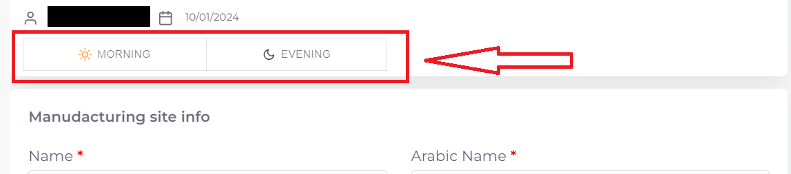
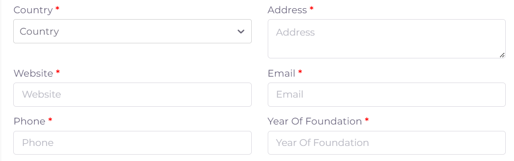
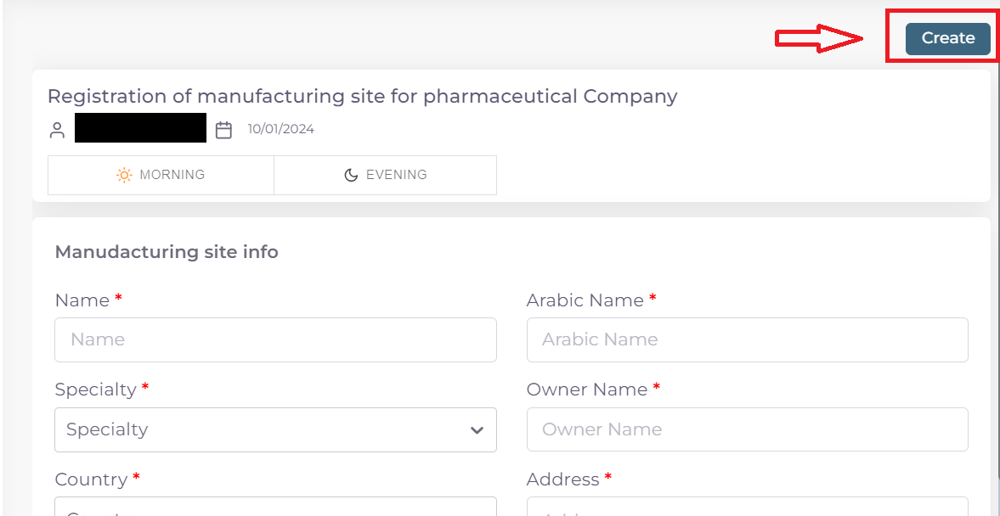

خطوات تقديم معاملة تسجيل موقع تصنيعي جديد
============================================

**اولا: بدء معاملة جديدة واختيار نوع المعاملة**:

1. من واجهه الحساب الرئيسية نضغط على زر new لغرض بدء معاملة جديدة:

.. image:: ../images/company/new-sub.png

2. ثم نختار نوع المعاملات المختصة بالمواقع التصنيعية:

.. image:: ../images/company/comp-type.png

3. ثم نختار نوع المعاملة وهي تسجيل موقع تصنيعي جديد:

.. image:: ../images/company/rigester-type.png

4. ثم نختار تخصص الموقع التصنيعي المراد تسجيله:

.. image:: ../images/company/sub-types.png

**ثانيا: ملئ المعلومات الاساسية للموقع التصنيعي وبدء المعاملة**:

.. image:: ../images/company/comp-info.png

.. note::
    اي حقل عليه علامة * هوة حقل اجباري ويجب ملئه للتقدم في المعاملة

    واي حقل لا يحوي هذه العلامة او يحوي على كلمة Optional فهوة حقل اختياري يمكن تركه او ملئه ولا يوثر على التقدم في المعاملة

1. اختيار وقت تدقيق المعاملة حسب اوقات الدوام الرسمي في الوزارة:

.. note::
    الشفت المسائي: يكون وقت تدقيق المعاملة من ال 8 صباحا الى ال 5 مسائا
    
    الشفت الصباحي: يكون وقت تدقيق المعاملة من 8 صباحا الى ال 2 مسائا

    الشفت المسائي يكون اسرع لان وقت التدقيق اليومي اكثر
    
    تكلفة التسجيل للشفت المسائي تكون اكثر من الصباحي

2. ثم نكتب اسم الموقع التصنيعي: 

.. image:: ../images/company/comp-names.png

.. note::
    حقل ال Name يكتب به اسم الموقع التصنيعي الموجود في الوثائق

    اما حقل ال Arabic Name يكتب به اللفظ العربي للاسم

    مثلا: اذا كان اسم الشركة في الوثائق هوة astrazeneca فيكتب في حقل ال Name

    اما في حقل ال Arabic Name فنكتب استرازنيكا وحسب اللفظ العربي الصحيح

3. اختيار تخصص الموقع التصنيعي:

.. image:: ../images/company/sprc.png

4. اسم الشخص المالك للموقع:

.. image:: ../images/company/boss.png

.. note::
    اذا لم تتوفر هذة المعلومة في ملفات الموقع فيكتب NA في الحقل 

5. ملئ معلومات عنوان الموقع ومعلومات التواصل وسنة التأسيس للموقع التصنيعي:

6. اختيار طبيعة الموقع التصنيعي

.. note::

    Manfacture وتعني طبيعة الموقع اذا كان هوة المصنع للمنتج
    
    او تعاقدي Contract manfacture

    Manfacture and Contract manfacture او كلاهما

7. ثم نعود الى بداية الصفحة ونضغط على Create لغرض بدء المعاملة:

