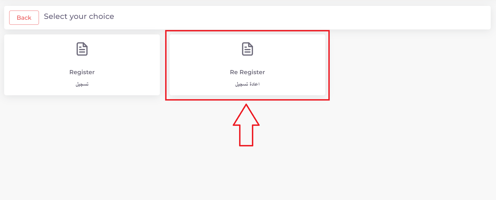
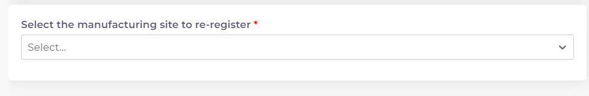

خطوات تقديم معاملة اعادة تسجيل لقاحات
========================================

**اولا: بدء معاملة جديدة واختيار نوع المعاملة**:

1. من واجهه الحساب الرئيسية نضغط على زر new لغرض بدء معاملة جديدة:

.. image:: ../images/company/new-sub.png

2. ثم نختار نوع المعاملات المختصة بالمستحضرات الدوائية:

.. image:: ../images/product/product-type.png

3. ثم نختار نوع المعاملة وهي اعادة تسجيل مستحضر دوائي:

4. ثم نختار تخصص المعاملة  حسب نوع المستحضر المراد اعادة تسجيله:

.. image:: ../images/product/re-rig-sub-types.png

**ثانيا:اختيار المستحضر الدوائي المراد اعادة تسجيله وبدء المعاملة**:

.. image:: ../images/product/-info-re.png

.. note::
    اي حقل عليه علامة * هوة حقل اجباري ويجب ملئه للتقدم في المعاملة

    واي حقل لا يحوي هذه العلامة او يحوي على كلمة Optional فهوة حقل اختياري يمكن تركه او ملئه ولا يوثر على التقدم في المعاملة

1. اختيار وقت تدقيق المعاملة:

.. image:: ../images/product/shift-re-.png

2. اختيار مستحضر دوائي مسجل مسبقا ومربوط بالمكتب العلمي او الشركة لغرض اعادة تسجيله:

.. warning::
    في حالة عدم ظهور المستحضر المسجل مسبقا في هذه الحقل:

    يجب تقديم معاملة طلب تخويل على المستحضر لغرض ربط المستحضر بحساب المكتب او الشركة وذلك بسبب ان المستحضر تم تسجيله قبل ظهور النظام الالكتروني.

    لغرض معرفة كيفية تقديم معاملة طلب التخويل يمكنك زيارة قسم :doc:`../../others`.

3. الرجوع الى بداية الصفحة والضغط على Create لبدء المعاملة:

.. image:: ../images/product/create-.png

4. فيتم بدء وانشاء المعاملة في النظام الالكتروني.

**ثالثا: ملئ قوائم متطلبات المعاملة Cheacklist**:

1. بعد بدء المعاملة نرى قسم قوائم المتطلبات Cheacklist على اليمين قد فتح الدخول له

.. image:: ../images/product/-check.png

.. warning::
    قبل البدء بملئ اي Cheacklist يجب مراعاة ما يلي:

    1. ملئ الحقول المطلوبة ان وجدت

    2. يجب رفع الملف الخاص في ال Cheacklist بصيغة pdf

    3. ان يكون الملف المقدم يحوي فقط اوراق الملف المخصصة لل Cheacklist

**كيفية ملئ الحقول ورفع الملفات لل Cheacklist وطريقة حفظ التقدم**:

* نضغط على احد المتطلبات للبدء بملؤها وتشمل المتطلبات :

1. رسالة التخويل Authorization letter: ويجب ان تكون نسخة مصدقة وقانونية صادرة من دولة الموقع التصنيعي.

**A) ملئ حقول ال Checklist:**

.. note::
    اي حقل يحوي على علامة * فهو حقل يجب ملؤه

    اما اذا لم يحوي على العلامة او كان يحوي على كلمة Optional فهو حقل اختياري

**وتشمل الحقول:**

.. image:: ../../images/company/al-fields.png

1. تاريخ اصدار رسالة التخويل Issuing Date.

2. تاريخ انتهاء رسالة التخويل Expiry Date.

3. حقل ملاحظات اختياري Note.

ثم نقوم بحفظ معلومات الحقول بعد ملئ كل الحقول المطلوبة عن طريق الضغط على زر Save Info في بداية الصفحة:

    .. image:: ../../images/company/field.png

في حالة حدوث خطأ في ادخال المعلومات وتم حفظ التقدم فيمكن التعديل على الحقول عن طريق الضغط على Edit:

.. image:: ../../images/company/edit.png
    
ثم تغيير الحقول المطلوبة والضغط على Save Info لحفظ التغييرات الجديدة او الضغط على Cancel لتجاهل التغييرات

.. image:: ../images/company/cancel-save.png

**B) رفع الملف (ويجب ان يكون بصيغة pdf)**:
  

1. لكي نقوم برفع الملف الخاص بهذة القائمة نقوم بالنزول لقسم Attachments في اخر الصفحة :

    .. image:: ../../images/company/attach.png

2. نقوم بالضغط على ايقونة الرفع واختيار ملف للرفع (يجب ان يكون الملف بصيغة pdf):

    .. image:: ../../images/company/upload.png

3. ويضهر الملف بعد رفعه كما موضح ادناه:

    .. image:: ../../images/company/upload-show.png

في حالة رغبتك بالتاكد من الملف فيمكنك:

.. image:: ../../images/company/folder-icon.png

عرض الملف المرفوع عن طريق الضغط على الايقونة رقم 1.
         
واذا اردت تنزيل الملف نضغط على الايقونة رقم 2 .
         
واذا اردت حذف الملف فنضغط على الايقونة رقم 3 (لا يمكن تعديل او حذف الملف بعد ارسال المعاملة).
         
واذا اردت اضافة ملاحظة حول الملف نضغط الايقونة رقم 4.

.. raw:: html

    

         
**C) حفظ ال Cheacklist**

بعد رفع الملف وملئ الحقول ان وجدت نعود الى بداية الصفحة ونضغط على save لغرض حفظ ال cheacklist :

.. image:: ../../images/company/save-chck.png

.. raw:: html

    

**رابعا) التاكد من المعلومات وارسال المعاملة:**

1. بعد ملئ كافة ال Cheacklist وتحول الحالة الى  Draft يمكن الان ارسال المعاملة وعمل Submit.

.. warning::
    لا يمكن تعديل اي حقول او ملفات بعد ارسال المعاملة لذلك يرجى التاكد جيدا قبل الارسال.
    وفي حال حدوث اي خطأ يرجى التواصل مع قسم الدعم الفني لتلقي المساعدة اللازمة

2. نضغط على زر Submit  في واجهه المعاملة الرئيسية لغرض ارسال المعاملة:

.. image:: ../../images/company/submit.png

.. warning::
    في حالة وجود خطأ في اختيار نوع المعاملة او شيئ مشابه يمكن اهمال المعاملة الحالية عن طريق الضغط على زر Neglect.

3. لتاكيد عملية الارسال نرى حالة المعاملة الرئيسية وحالة كل Cheaklist  قد تحولت الى Submitted اي تم الارسال بنجاح.

.. image:: ../../images/company/f-submit.png

4. بعد الانتهاء من الارسال يجب مراجعة وزارة الصحة/ دائرة الامور الفنية/ قسم التسجيل  مع جلب الملفات المصدقة والاصلية المطلوبة وايضا لدفع فاتورة الاستمارة الالكترونية.

