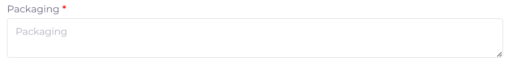

خطوات تقديم معاملة تسجيل مستحضر اجنبي- سريع (ملفات كاملة).
==============================================================

**اولا: بدء معاملة جديدة واختيار نوع المعاملة**:

1. من واجهه الحساب الرئيسية نضغط على زر new لغرض بدء معاملة جديدة:

.. image:: ../../images/company/new-sub.png

2. ثم نختار نوع المعاملات المختصة في المنتجات والمستحضرات الدوائية:

.. image:: ../../images/product/product-type.png

3. ثم نختار نوع المعاملة وهي تسجيل منتج او مستحضر جديد:

4. ثم نختار تخصص معاملة تسجيل المستحضر وهو تسجيل مستحضر اجنبي عادي :

**ثانيا: ملئ المعلومات الاساسية للمستحضر وبدء المعاملة**:

.. image:: ../../images/product/product-info-fpr.png

.. note::
    اي حقل عليه علامة * هوة حقل اجباري ويجب ملئه للتقدم في المعاملة

    واي حقل لا يحوي هذه العلامة او يحوي على كلمة Optional فهوة حقل اختياري يمكن تركه او ملئه ولا يوثر على التقدم في المعاملة

1. اختيار وقت تدقيق المعاملة:

.. image:: ../../images/product/shift.png

2. ثم نكتب الرمز الوطني National Code الخاص بالمادة او المواد العلمية للمستحضر المراد تسجيله:

.. warning::
    يجب مراعاة الرموز والاحرف عند كتابة الرمز الوطني لكي يتعرف عليه النظام بنجاح

        
.. note::
    يتم الحصول على الرمز الوطني من خلال مراجعة هيئة الدواء في وزارة الصحة

3. اختيار الاسم العلمي Scientific Name:

.. image:: ../../images/product/scin-name.png

.. note::
    الخيارات في هذا الحقل تعتمد وتكون مربوطة بالرمز الوطني الذي تم ادخاله

4. اختيار شكل او طبيعة الجرعة او المستحضر Dosage Form:

.. image:: ../../images/product/d-form.png

.. note::
    الخيارات في هذا الحقل تعتمد وتكون مربوطة بالرمز الوطني الذي تم ادخاله

5. اختيار طريقة او مسار اخذ الجرعة او المستحضر Route Of Administration:

6. كتابة الاسم التجاري للمستحضر Trade Name:

.. image:: ../../images/product/trad-name.png

7. كتابة اسم الجهه المسئولة او المخولة لتسويق المنتج MAH وايضا اختيار دولة الجهه:

8. ادخال حجم التعبئة للمنتج Pack Size:

.. image:: ../../images/product/pack-size.png

في حالة وجود اكثر من تعبئة واحدة لللمستحضر نضغط على زر ال Add:

وفي حالة رغبة حذف احد التعبئات نضغط على ايقونة الحذف:

.. image:: ../../images/product/pack-del.png

9. اختيار درجة حرارة تخزين المستحضر Storage Temp:

10. كتابة توجيهات الخزن Storage Direction وتوجيهات النقل Transport Direction:

.. image:: ../../images/product/st-tr-direction.png

11. ادخال تفاصيل التعبئة الخاصة بالمستحضر Packiging:

12. ادخال نوع او مادة حاوية الدواء Container Type:

13. ادخال عمر الرف للمنتج Shelf life وعمر المنتج بعد الفتح In use life وهل يحوي كحول Contains alcohol:

14. ادخال الوصف النهائي للمستحضر Description Of Finished Product:

15. في حالة وجود اي شهادات ساندة للمنتج فيمكن اضافتها من قسم ال Certificates:

.. image:: ../../images/product/certificate.png

16. اضافة الموقع التصنيعي للمستحضر المراد تسجيله (يجب ان يكون الموقع مسجلا ومرتبط بالمكتب العلمي):

.. image:: ../../images/product/select-manf.png

بعد اضافة موقع نختار تخصص او دور الموقع في عملية صنع المستحضر:

.. image:: ../../images/product/add-manf.png

.. note::
    في حالة كان موقع تصنيعي وحيد يشارك في صنع عجينة المستحضر الاساسية وايضا عملية التغليف الاولية والثانوية بلاضافة الى التوزيع

    فيحتاج فقط اضافة موقع تصنيعي واحد مسجل عند المكتب العلمي ويكون دور المصنع هوة All.

.. warning::
    اما في حالة وجود اكثر من من موقع تصنيعي يساهم في عملية انتاج المستحضر النهائي فيجب اضافة هذة المواقع كافة وهي كالاتي:

    اذا كان الموقع التصنيعي هوة الذي يقوم بصنع عجينة او مادة المستحضر نختار Bulk Manfacture (يجب ان يكون الموقع مسجلا ومرتبط بالمكتب العلمي).

    اذا كان الموقع يقوم بالتغليف الاولي والثانوي للمستحضر فنختار Primary & Secondary Packager (يجب ان يكون الموقع مسجلا ومرتبط بالمكتب العلمي).

    اذا كان الموقع يقوم بالتغليف الاولي فقط فنختار Primary Packager (يجب ان يكون الموقع مسجلا ومرتبط بالمكتب العلمي).

    اذا كان الموقع يقوم بالتغليف الثانوي فنختار Secondary Packager (لا يحتاج الى تسجيل فقط ادخال معلومات الموقع).

    اذا كان الموقع يقوم بتوزيع المنتج فقط فنختار Batch Releaser (لا يحتاج الى تسجيل فقط ادخال معلومات الموقع).

بعد اختيار دور الموقع Role ياتي الان دور اختيار الموقع التصنيعي المربوط بحساب المكتب العلمي:

ثم بعد اختيار الموقع التصنيعي واختيار دوره ايضا يجب الان اختيار الخط الانتاجي المسجل مسبقا للموقع المختار لغرض تسجيل المستحضر عليه.

.. image:: ../../images/product/pl.png

ثم نقوم بالضغط على Save لحفظ الموقع.

.. image:: ../../images/product/pl-save.png

ويمكن تعديل معلومات الموقع في حالة وجود خطأ عن طريق الضغط على edit.

.. image:: ../../images/product/pl-edit.png

**لاضافة موقع اخر يمكن الضغط على الايقونة:**

.. image:: ../../images/product/pl-add.png

17. بعد التاكد من جميع المعلومات نعود الى بداية الصفحة ونضغط على Create لغرض بدء المعاملة:

18. فيتم بدء وانشاء المعاملة في النظام الالكتروني.

**ثالثا: ملئ قوائم متطلبات المعاملة Cheacklist**:

1. بعد بدء المعاملة نرى قسم قوائم المتطلبات Cheacklist على اليمين قد فتح الدخول له

.. image:: ../../images/product/checklist-home.png

.. warning::
    قبل البدء بملئ اي Cheacklist يجب مراعاة ما يلي:

    1. ملئ الحقول المطلوبة ان وجدت

    2. يجب رفع الملف الخاص في ال Cheacklist بصيغة pdf

    3. ان يكون الملف المقدم يحوي فقط اوراق الملف المخصصة لل Cheacklist

**كيفية ملئ الحقول ورفع الملفات لل Cheacklist وطريقة حفظ التقدم**:

* نضغط على احد المتطلبات للبدء بملؤها وتشمل المتطلبات :

1. رسالة طلب تسجيل المستحضر requesting product registration ويجب رفع النسخة الاصلية.

**A) ملئ حقول ال Checklist:**

.. note::
    اي حقل يحتوي على علامة * فهو حقل يجب ملؤه

    اما اذا لم يحتوي على العلامة او كان يحتوي على كلمة Optional فهو حقل اختياري

**وتشمل الحقول:**

حقل ملاحظات اختياري Note.

ثم نقوم بحفظ معلومات الحقول بعد ملئ كل الحقول المطلوبة عن طريق الضغط على زر Save Info في بداية الصفحة:

    .. image:: ../../images/company/field.png

في حالة حدوث خطأ في ادخال المعلومات وتم حفظ التقدم فيمكن التعديل على الحقول عن طريق الضغط على Edit:

.. image:: ../../images/company/edit.png
    
ثم تغيير الحقول المطلوبة والضغط على Save Info لحفظ التغييرات الجديدة او الضغط على Cancel لتجاهل التغييرات

.. image:: ../../images/company/cancel-save.png

**B) رفع الملف (ويجب ان يكون بصيغة pdf)**:
  

1. لكي نقوم برفع الملف الخاص بهذة القائمة نقوم بالنزول لقسم Attachments في اخر الصفحة :

    .. image:: ../../images/company/attach.png

2. نقوم بالضغط على ايقونة الرفع واختيار ملف للرفع (يجب ان يكون الملف بصيغة pdf):

    .. image:: ../../images/company/upload.png

3. ويضهر الملف بعد رفعه كما موضح ادناه:

    .. image:: ../../images/company/upload-show.png

في حالة رغبتك بالتاكد من الملف فيمكنك:

.. image:: ../../images/company/folder-icon.png

عرض الملف المرفوع عن طريق الضغط على الايقونة رقم 1.
         
واذا اردت تنزيل الملف نضغط على الايقونة رقم 2 .
         
واذا اردت حذف الملف فنضغط على الايقونة رقم 3 (لا يمكن تعديل او حذف الملف بعد ارسال المعاملة).
         
واذا اردت اضافة ملاحظة حول الملف نضغط الايقونة رقم 4.

.. raw:: html

    

         
**C) حفظ ال checklist**

بعد رفع الملف وملئ الحقول ان وجدت نعود الى بداية الصفحة ونضغط على save لغرض حفظ ال checklist :

.. image:: ../../images/company/save-chck.png

.. raw:: html

    

2. رسالة التخويل Authorization letter ويجب ان تكون نسخة مصدقة وقانونية صادرة الشركة للمكتب العلمي:

**A) ملئ حقول ال Checklist:**

.. note::
    اي حقل يحتوي على علامة * فهو حقل يجب ملؤه

    اما اذا لم يحتوي على العلامة او كان يحتوي على كلمة Optional فهو حقل اختياري

**وتشمل الحقول:**

.. image:: ../../images/company/al-fields.png

1. تاريخ اصدار رسالة التخويل Issuing Date.

2. تاريخ انتهاء رسالة التخويل Expiry Date.

3. حقل ملاحظات اختياري Note.

ثم نقوم بحفظ معلومات الحقول بعد ملئ كل الحقول المطلوبة عن طريق الضغط على زر Save Info في بداية الصفحة:

    .. image:: ../../images/company/field.png

في حالة حدوث خطأ في ادخال المعلومات وتم حفظ التقدم فيمكن التعديل على الحقول عن طريق الضغط على Edit:

.. image:: ../../images/company/edit.png
    
ثم تغيير الحقول المطلوبة والضغط على Save Info لحفظ التغييرات الجديدة او الضغط على Cancel لتجاهل التغييرات

.. image:: ../../images/company/cancel-save.png

**B) رفع الملف (ويجب ان يكون بصيغة pdf)**:
  

1. لكي نقوم برفع الملف الخاص بهذة القائمة نقوم بالنزول لقسم Attachments في اخر الصفحة :

    .. image:: ../../images/company/attach.png

2. نقوم بالضغط على ايقونة الرفع واختيار ملف للرفع (يجب ان يكون الملف بصيغة pdf):

    .. image:: ../../images/company/upload.png

3. ويضهر الملف بعد رفعه كما موضح ادناه:

    .. image:: ../../images/company/upload-show.png

في حالة رغبتك بالتاكد من الملف فيمكنك:

.. image:: ../../images/company/folder-icon.png

عرض الملف المرفوع عن طريق الضغط على الايقونة رقم 1.
         
واذا اردت تنزيل الملف نضغط على الايقونة رقم 2 .
         
واذا اردت حذف الملف فنضغط على الايقونة رقم 3 (لا يمكن تعديل او حذف الملف بعد ارسال المعاملة).
         
واذا اردت اضافة ملاحظة حول الملف نضغط الايقونة رقم 4.

.. raw:: html

    

         
**C) حفظ ال checklist**

بعد رفع الملف وملئ الحقول ان وجدت نعود الى بداية الصفحة ونضغط على save لغرض حفظ ال checklist :

.. image:: ../../images/company/save-chck.png

.. raw:: html

    

3. فورمة التسجيل Registration form Appendix تحوي ختم وتوقيع مدير الموقع او الشركة على جميع الصفحات:

**A) ملئ حقول ال Checklist:**

لا يحتوي هذا المتطلب على حقول لللمعلومات

**B) رفع الملف (ويجب ان يكون بصيغة pdf)**:
  

1. لكي نقوم برفع الملف الخاص بهذة القائمة نقوم بالنزول لقسم Attachments في اخر الصفحة :

    .. image:: ../../images/company/attach.png

2. نقوم بالضغط على ايقونة الرفع واختيار ملف للرفع (يجب ان يكون الملف بصيغة pdf):

    .. image:: ../../images/company/upload.png

3. ويضهر الملف بعد رفعه كما موضح ادناه:

    .. image:: ../../images/company/upload-show.png

.. raw:: html

    

**C) حفظ ال checklist**

بعد رفع الملف وملئ الحقول ان وجدت نعود الى بداية الصفحة ونضغط على save لغرض حفظ ال checklist :

.. image:: ../../images/company/save-chck.png

.. raw:: html

    

4. شهادة المستحضر الدوائي الاصلية Certificate of Pharmaceutical Product مصدقة قانونيا:

**A) ملئ حقول ال Checklist:**

نقوم بملئ كافة الحقول الاتية:

1. بلد المنشأ لل CPP.

2. الجهه المصدرة لل CPP.

3. تاريخ اصدار ال CPP.

4. تاريخ انتهاء صلاحية ال CPP.

5. دولة المنشأ للمستحضر (حقل اختياري)

6.  الاسم التجاري داخل العراق (حقل اختياري)

7. طريقة الاخذ (حقل اختياري)

8. حجم التعبئه (حقل اختياري)

ثم نقوم بحفظ معلومات الحقول بعد ملئ كل الحقول المطلوبة عن طريق الضغط على زر Save Info في بداية الصفحة:

    .. image:: ../../images/company/field.png

**B) رفع الملف (ويجب ان يكون بصيغة pdf)**:
  

1. لكي نقوم برفع الملف الخاص بهذة القائمة نقوم بالنزول لقسم Attachments في اخر الصفحة :

    .. image:: ../../images/company/attach.png

2. نقوم بالضغط على ايقونة الرفع واختيار ملف للرفع (يجب ان يكون الملف بصيغة pdf):

    .. image:: ../../images/company/upload.png

3. ويضهر الملف بعد رفعه كما موضح ادناه:

    .. image:: ../../images/company/upload-show.png

.. raw:: html

    

         
**C) حفظ ال checklist**

بعد رفع الملف وملئ الحقول ان وجدت نعود الى بداية الصفحة ونضغط على save لغرض حفظ ال checklist :

.. image:: ../../images/company/save-chck.png

**يمكننا اضافة cpp اخر حسب المعاملة او المستحضر عن طريق الضغط على ايقونة Add Another Cpp في اعلى الصفحة.**

.. raw:: html

    

5. نسخة من شهادة التحليل النهائية للمستحضر Method of analysis مختومة من قبل الموقع التصنيعي:

**A) ملئ حقول ال Checklist:**

لا يحتوي هذا المتطلب على حقول لللمعلومات

**B) رفع الملف (ويجب ان يكون بصيغة pdf)**:
  

1. لكي نقوم برفع الملف الخاص بهذة القائمة نقوم بالنزول لقسم Attachments في اخر الصفحة :

    .. image:: ../../images/company/attach.png

2. نقوم بالضغط على ايقونة الرفع واختيار ملف للرفع (يجب ان يكون الملف بصيغة pdf):

    .. image:: ../../images/company/upload.png

3. ويضهر الملف بعد رفعه كما موضح ادناه:

    .. image:: ../../images/company/upload-show.png

.. raw:: html

    

**C) حفظ ال checklist**

بعد رفع الملف وملئ الحقول ان وجدت نعود الى بداية الصفحة ونضغط على save لغرض حفظ ال checklist :

.. image:: ../../images/company/save-chck.png

.. raw:: html

    

6.  دراسة الثباتية Stability study for 3 batches اصلية وحسب ضوابط دراسات الثبوتية مختومة من الشركة/الشركات المصنعة:

**A) ملئ حقول ال Checklist:**

لا يحتوي هذا المتطلب على حقول لللمعلومات

**B) رفع الملف (ويجب ان يكون بصيغة pdf)**:
  

1. لكي نقوم برفع الملف الخاص بهذة القائمة نقوم بالنزول لقسم Attachments في اخر الصفحة :

    .. image:: ../../images/company/attach.png

2. نقوم بالضغط على ايقونة الرفع واختيار ملف للرفع (يجب ان يكون الملف بصيغة pdf):

    .. image:: ../../images/company/upload.png

3. ويضهر الملف بعد رفعه كما موضح ادناه:

    .. image:: ../../images/company/upload-show.png

.. raw:: html

    

**C) حفظ ال checklist**

بعد رفع الملف وملئ الحقول ان وجدت نعود الى بداية الصفحة ونضغط على save لغرض حفظ ال checklist :

.. image:: ../../images/company/save-chck.png

.. raw:: html

    

7.  شهادة التحليل للمنتج النهائي Certificate of analysis موقعة ومختومة من قبل شركة الصناعة:

**A) ملئ حقول ال Checklist:**

**وتشمل الحقول:**

حقل ملاحظات اختياري Note.

ثم نقوم بحفظ معلومات الحقول بعد ملئ كل الحقول المطلوبة عن طريق الضغط على زر Save Info في بداية الصفحة:

    .. image:: ../../images/company/field.png

**B) رفع الملف (ويجب ان يكون بصيغة pdf)**:
  

1. لكي نقوم برفع الملف الخاص بهذة القائمة نقوم بالنزول لقسم Attachments في اخر الصفحة :

    .. image:: ../../images/company/attach.png

2. نقوم بالضغط على ايقونة الرفع واختيار ملف للرفع (يجب ان يكون الملف بصيغة pdf):

    .. image:: ../../images/company/upload.png

3. ويضهر الملف بعد رفعه كما موضح ادناه:

    .. image:: ../../images/company/upload-show.png

.. raw:: html

    

         
**C) حفظ ال checklist**

بعد رفع الملف وملئ الحقول ان وجدت نعود الى بداية الصفحة ونضغط على save لغرض حفظ ال checklist :

.. image:: ../../images/company/save-chck.png

.. raw:: html

    

8. طريقة التصنيع ومخطط التدفق Method of manufacturing & flow chart موقعة ومختومة من قبل الشركة المصنعه:

**A) ملئ حقول ال Checklist:**

**وتشمل الحقول:**

حقل ملاحظات اختياري Note.

ثم نقوم بحفظ معلومات الحقول بعد ملئ كل الحقول المطلوبة عن طريق الضغط على زر Save Info في بداية الصفحة:

    .. image:: ../../images/company/field.png

**B) رفع الملف (ويجب ان يكون بصيغة pdf)**:
  

1. لكي نقوم برفع الملف الخاص بهذة القائمة نقوم بالنزول لقسم Attachments في اخر الصفحة :

    .. image:: ../../images/company/attach.png

2. نقوم بالضغط على ايقونة الرفع واختيار ملف للرفع (يجب ان يكون الملف بصيغة pdf):

    .. image:: ../../images/company/upload.png

3. ويضهر الملف بعد رفعه كما موضح ادناه:

    .. image:: ../../images/company/upload-show.png

.. raw:: html

    

         
**C) حفظ ال checklist**

بعد رفع الملف وملئ الحقول ان وجدت نعود الى بداية الصفحة ونضغط على save لغرض حفظ ال checklist :

.. image:: ../../images/company/save-chck.png

.. raw:: html

    

9.  مواصفات المنتج النهائي Specification of finished product أدخل مواصفات المنتج النهائي بالكامل في الحقل أدناه وقم بإرفاق ملف موقع من قبل الشركة المصنعة:

**A) ملئ حقول ال Checklist:**

**وتشمل الحقول:**

الوصف الكامل للمنتج النهائي

ثم نقوم بحفظ معلومات الحقول بعد ملئ كل الحقول المطلوبة عن طريق الضغط على زر Save Info في بداية الصفحة:

    .. image:: ../../images/company/field.png

**B) رفع الملف (ويجب ان يكون بصيغة pdf)**:
  

1. لكي نقوم برفع الملف الخاص بهذة القائمة نقوم بالنزول لقسم Attachments في اخر الصفحة :

    .. image:: ../../images/company/attach.png

2. نقوم بالضغط على ايقونة الرفع واختيار ملف للرفع (يجب ان يكون الملف بصيغة pdf):

    .. image:: ../../images/company/upload.png

3. ويضهر الملف بعد رفعه كما موضح ادناه:

    .. image:: ../../images/company/upload-show.png

.. raw:: html

    

         
**C) حفظ ال checklist**

بعد رفع الملف وملئ الحقول ان وجدت نعود الى بداية الصفحة ونضغط على save لغرض حفظ ال checklist :

.. image:: ../../images/company/save-chck.png

.. raw:: html

    

10. تركيبة المنتج Product formula (composition):

**A) ملئ حقول ال Checklist:**

1. حقل الملاحظات

2. تركيبة العنصر

3. اضافة عنصر فعال

4. اضافة عنصر غير فعال

.. note:: 
    يجب اضافة جميع العناصر الفعالة (حقل مطلوب)

    اما العناصر غير الفعالة فهي اختيارية

**ثم نملئ حقول معلومات العنصر**:

1. اسم المادة الخام

2. معيار الجودة

3. الوظيفة او التأثير

4. المنشأ

5. كفاية الكمية : إذا كانت المادة غير كافية وحدها نفعل الاختيار

6. الكمية

7. وحدة القياس

8. اضافة مصادر المادة

.. warning::
    يجب على الاقل اضافة مصدر واحد للمادة لغرض التقدم

وتشمل حقول:

1. الاسم

2. الدولة

**B) رفع الملف (ويجب ان يكون بصيغة pdf)**:
  

1. لكي نقوم برفع الملف الخاص بهذة القائمة نقوم بالنزول لقسم Attachments في اخر الصفحة :

    .. image:: ../../images/company/attach.png

2. نقوم بالضغط على ايقونة الرفع واختيار ملف للرفع (يجب ان يكون الملف بصيغة pdf):

    .. image:: ../../images/company/upload.png

3. ويضهر الملف بعد رفعه كما موضح ادناه:

    .. image:: ../../images/company/upload-show.png

.. raw:: html

    

**C) حفظ ال checklist**

بعد رفع الملف وملئ الحقول ان وجدت نعود الى بداية الصفحة ونضغط على save لغرض حفظ ال checklist :

.. image:: ../../images/company/save-chck.png

.. raw:: html

    

11. مواصفات مواد التعبئة  (الأولية والثانوية) Specification of packaging materials (primary & secondary) مختومة وموقعة:

**A) ملئ حقول ال Checklist:**

**وتشمل الحقول:**

حقل ملاحظات اختياري Note.

ثم نقوم بحفظ معلومات الحقول بعد ملئ كل الحقول المطلوبة عن طريق الضغط على زر Save Info في بداية الصفحة:

    .. image:: ../../images/company/field.png

**B) رفع الملف (ويجب ان يكون بصيغة pdf)**:
  

1. لكي نقوم برفع الملف الخاص بهذة القائمة نقوم بالنزول لقسم Attachments في اخر الصفحة :

    .. image:: ../../images/company/attach.png

2. نقوم بالضغط على ايقونة الرفع واختيار ملف للرفع (يجب ان يكون الملف بصيغة pdf):

    .. image:: ../../images/company/upload.png

3. ويضهر الملف بعد رفعه كما موضح ادناه:

    .. image:: ../../images/company/upload-show.png

.. raw:: html

    

         
**C) حفظ ال checklist**

بعد رفع الملف وملئ الحقول ان وجدت نعود الى بداية الصفحة ونضغط على save لغرض حفظ ال checklist :

.. image:: ../../images/company/save-chck.png

.. raw:: html

    

12. العمل الفني الملون للعبوة الخارجية Colored artwork of outer package مختوم من قبل الشركة:

**A) ملئ حقول ال Checklist:**

**وتشمل الحقول:**

حقل ملاحظات اختياري Note.

ثم نقوم بحفظ معلومات الحقول بعد ملئ كل الحقول المطلوبة عن طريق الضغط على زر Save Info في بداية الصفحة:

    .. image:: ../../images/company/field.png

**B) رفع الملف (ويجب ان يكون بصيغة pdf)**:
  

1. لكي نقوم برفع الملف الخاص بهذة القائمة نقوم بالنزول لقسم Attachments في اخر الصفحة :

    .. image:: ../../images/company/attach.png

2. نقوم بالضغط على ايقونة الرفع واختيار ملف للرفع (يجب ان يكون الملف بصيغة pdf):

    .. image:: ../../images/company/upload.png

3. ويضهر الملف بعد رفعه كما موضح ادناه:

    .. image:: ../../images/company/upload-show.png

.. raw:: html

    

         
**C) حفظ ال checklist**

بعد رفع الملف وملئ الحقول ان وجدت نعود الى بداية الصفحة ونضغط على save لغرض حفظ ال checklist :

.. image:: ../../images/company/save-chck.png

.. raw:: html

    

13. العمل الفني للعلامة الداخلية Colored artwork of inner label مختوم من قبل الشركة:

**A) ملئ حقول ال Checklist:**

**وتشمل الحقول:**

حقل ملاحظات اختياري Note.

ثم نقوم بحفظ معلومات الحقول بعد ملئ كل الحقول المطلوبة عن طريق الضغط على زر Save Info في بداية الصفحة:

    .. image:: ../../images/company/field.png

**B) رفع الملف (ويجب ان يكون بصيغة pdf)**:
  

1. لكي نقوم برفع الملف الخاص بهذة القائمة نقوم بالنزول لقسم Attachments في اخر الصفحة :

    .. image:: ../../images/company/attach.png

2. نقوم بالضغط على ايقونة الرفع واختيار ملف للرفع (يجب ان يكون الملف بصيغة pdf):

    .. image:: ../../images/company/upload.png

3. ويضهر الملف بعد رفعه كما موضح ادناه:

    .. image:: ../../images/company/upload-show.png

.. raw:: html

    

         
**C) حفظ ال checklist**

بعد رفع الملف وملئ الحقول ان وجدت نعود الى بداية الصفحة ونضغط على save لغرض حفظ ال checklist :

.. image:: ../../images/company/save-chck.png

.. raw:: html

    

14. العمل الفني للكتيب Colored artwork of leaflet (Arabic and English) مختوم من قبل الشركة:

**A) ملئ حقول ال Checklist:**

**وتشمل الحقول:**

حقل ملاحظات اختياري Note.

ثم نقوم بحفظ معلومات الحقول بعد ملئ كل الحقول المطلوبة عن طريق الضغط على زر Save Info في بداية الصفحة:

    .. image:: ../../images/company/field.png

**B) رفع الملف (ويجب ان يكون بصيغة pdf)**:
  

1. لكي نقوم برفع الملف الخاص بهذة القائمة نقوم بالنزول لقسم Attachments في اخر الصفحة :

    .. image:: ../../images/company/attach.png

2. نقوم بالضغط على ايقونة الرفع واختيار ملف للرفع (يجب ان يكون الملف بصيغة pdf):

    .. image:: ../../images/company/upload.png

3. ويضهر الملف بعد رفعه كما موضح ادناه:

    .. image:: ../../images/company/upload-show.png

.. raw:: html

    

         
**C) حفظ ال checklist**

بعد رفع الملف وملئ الحقول ان وجدت نعود الى بداية الصفحة ونضغط على save لغرض حفظ ال checklist :

.. image:: ../../images/company/save-chck.png

.. raw:: html

    

15. المواصفات أثناء العملية In-process specification مختوم من قبل الشركة:

**A) ملئ حقول ال Checklist:**

**وتشمل الحقول:**

حقل ملاحظات اختياري Note.

ثم نقوم بحفظ معلومات الحقول بعد ملئ كل الحقول المطلوبة عن طريق الضغط على زر Save Info في بداية الصفحة:

    .. image:: ../../images/company/field.png

**B) رفع الملف (ويجب ان يكون بصيغة pdf)**:
  

1. لكي نقوم برفع الملف الخاص بهذة القائمة نقوم بالنزول لقسم Attachments في اخر الصفحة :

    .. image:: ../../images/company/attach.png

2. نقوم بالضغط على ايقونة الرفع واختيار ملف للرفع (يجب ان يكون الملف بصيغة pdf):

    .. image:: ../../images/company/upload.png

3. ويضهر الملف بعد رفعه كما موضح ادناه:

    .. image:: ../../images/company/upload-show.png

.. raw:: html

    

         
**C) حفظ ال checklist**

بعد رفع الملف وملئ الحقول ان وجدت نعود الى بداية الصفحة ونضغط على save لغرض حفظ ال checklist :

.. image:: ../../images/company/save-chck.png

.. raw:: html

    

16. شهادة الجيلاتين  (خالية من مرض جنون اليقر وليست من أصل خنزير) ملف مختوم من قبل الشركة وايضا يحتوي على ختم جهه صحية:

**A) ملئ حقول ال Checklist:**

**وتشمل الحقول:**

حقل ملاحظات اختياري Note.

ثم نقوم بحفظ معلومات الحقول بعد ملئ كل الحقول المطلوبة عن طريق الضغط على زر Save Info في بداية الصفحة:

    .. image:: ../../images/company/field.png

**B) رفع الملف (ويجب ان يكون بصيغة pdf)**:
  

1. لكي نقوم برفع الملف الخاص بهذة القائمة نقوم بالنزول لقسم Attachments في اخر الصفحة :

    .. image:: ../../images/company/attach.png

2. نقوم بالضغط على ايقونة الرفع واختيار ملف للرفع (يجب ان يكون الملف بصيغة pdf):

    .. image:: ../../images/company/upload.png

3. ويضهر الملف بعد رفعه كما موضح ادناه:

    .. image:: ../../images/company/upload-show.png

.. raw:: html

    

         
**C) حفظ ال checklist**

بعد رفع الملف وملئ الحقول ان وجدت نعود الى بداية الصفحة ونضغط على save لغرض حفظ ال checklist :

.. image:: ../../images/company/save-chck.png

.. raw:: html

    

17. التحقق من صحة طريقة التحليل Validation of method of analysis:

**A) ملئ حقول ال Checklist:**

**وتشمل الحقول:**

حقل ملاحظات اختياري Note.

ثم نقوم بحفظ معلومات الحقول بعد ملئ كل الحقول المطلوبة عن طريق الضغط على زر Save Info في بداية الصفحة:

    .. image:: ../../images/company/field.png

**B) رفع الملف (ويجب ان يكون بصيغة pdf)**:
  

1. لكي نقوم برفع الملف الخاص بهذة القائمة نقوم بالنزول لقسم Attachments في اخر الصفحة :

    .. image:: ../../images/company/attach.png

2. نقوم بالضغط على ايقونة الرفع واختيار ملف للرفع (يجب ان يكون الملف بصيغة pdf):

    .. image:: ../../images/company/upload.png

3. ويضهر الملف بعد رفعه كما موضح ادناه:

    .. image:: ../../images/company/upload-show.png

.. raw:: html

    

         
**C) حفظ ال checklist**

بعد رفع الملف وملئ الحقول ان وجدت نعود الى بداية الصفحة ونضغط على save لغرض حفظ ال checklist :

.. image:: ../../images/company/save-chck.png

.. raw:: html

    

18. قائمة الدول التي تم فيها تسجيل المنتج List of countries where item registered  أضف جميع الدول التي تم فيها تسجيل المنتج في الحقول أدناه:

**A) ملئ حقول ال Checklist:**

**وتشمل الحقول:**

1. اسم الدولة

2. حقل للملاحظات

3. لغرض اضافة اكثر من دولة

ثم نقوم بحفظ معلومات الحقول بعد ملئ كل الحقول المطلوبة عن طريق الضغط على زر Save Info في بداية الصفحة:

    .. image:: ../../images/company/field.png

**B) رفع الملف (ويجب ان يكون بصيغة pdf)**:
  

1. لكي نقوم برفع الملف الخاص بهذة القائمة نقوم بالنزول لقسم Attachments في اخر الصفحة :

    .. image:: ../../images/company/attach.png

2. نقوم بالضغط على ايقونة الرفع واختيار ملف للرفع (يجب ان يكون الملف بصيغة pdf):

    .. image:: ../../images/company/upload.png

3. ويضهر الملف بعد رفعه كما موضح ادناه:

    .. image:: ../../images/company/upload-show.png

.. raw:: html

    

         
**C) حفظ ال checklist**

بعد رفع الملف وملئ الحقول ان وجدت نعود الى بداية الصفحة ونضغط على save لغرض حفظ ال checklist :

.. image:: ../../images/company/save-chck.png

.. raw:: html

    

19.  دراسة التوافر الحيوي أو التكافؤ الحيوي Comparative dissolution profile or bioequivalence study:

**A) ملئ حقول ال Checklist:**

لا يحتوي هذا المتطلب على حقول لللمعلومات

**B) رفع الملف (ويجب ان يكون بصيغة pdf)**:
  

1. لكي نقوم برفع الملف الخاص بهذة القائمة نقوم بالنزول لقسم Attachments في اخر الصفحة :

    .. image:: ../../images/company/attach.png

2. نقوم بالضغط على ايقونة الرفع واختيار ملف للرفع (يجب ان يكون الملف بصيغة pdf):

    .. image:: ../../images/company/upload.png

3. ويضهر الملف بعد رفعه كما موضح ادناه:

    .. image:: ../../images/company/upload-show.png

.. raw:: html

    

**C) حفظ ال checklist**

بعد رفع الملف وملئ الحقول ان وجدت نعود الى بداية الصفحة ونضغط على save لغرض حفظ ال checklist :

.. image:: ../../images/company/save-chck.png

.. raw:: html

    

20. شهادة الملاءمة Certificate of suitability أرفق الملفات للمواد الخام أو نسخة من شهادة GMP من السلطة في بلد الإنتاج للمواد الخام النشطة، موقعة ومختومة من قبل شركة الإنتاج. 

**A) ملئ حقول ال Checklist:**

**وتشمل الحقول:**

حقل ملاحظات اختياري Note.

ثم نقوم بحفظ معلومات الحقول بعد ملئ كل الحقول المطلوبة عن طريق الضغط على زر Save Info في بداية الصفحة:

    .. image:: ../../images/company/field.png

**B) رفع الملف (ويجب ان يكون بصيغة pdf)**:
  

1. لكي نقوم برفع الملف الخاص بهذة القائمة نقوم بالنزول لقسم Attachments في اخر الصفحة :

    .. image:: ../../images/company/attach.png

2. نقوم بالضغط على ايقونة الرفع واختيار ملف للرفع (يجب ان يكون الملف بصيغة pdf):

    .. image:: ../../images/company/upload.png

3. ويضهر الملف بعد رفعه كما موضح ادناه:

    .. image:: ../../images/company/upload-show.png

.. raw:: html

    

         
**C) حفظ ال checklist**

بعد رفع الملف وملئ الحقول ان وجدت نعود الى بداية الصفحة ونضغط على save لغرض حفظ ال checklist :

.. image:: ../../images/company/save-chck.png

.. raw:: html

    

21. شهادة السعر Price certificate قم بإرفاق جميع شهادات الأسعار المطلوبة بالدولار أو اليورو (مصنع EX، CIF في العراق، CIF في 3 دول مجاورة، CIF في الدول الأوروبية) مصدقة:

**A) ملئ حقول ال Checklist:**

**وتشمل الحقول:**

حقل ملاحظات اختياري Note.

ثم نقوم بحفظ معلومات الحقول بعد ملئ كل الحقول المطلوبة عن طريق الضغط على زر Save Info في بداية الصفحة:

    .. image:: ../../images/company/field.png

**B) رفع الملف (ويجب ان يكون بصيغة pdf)**:
  

1. لكي نقوم برفع الملف الخاص بهذة القائمة نقوم بالنزول لقسم Attachments في اخر الصفحة :

    .. image:: ../../images/company/attach.png

2. نقوم بالضغط على ايقونة الرفع واختيار ملف للرفع (يجب ان يكون الملف بصيغة pdf):

    .. image:: ../../images/company/upload.png

3. ويضهر الملف بعد رفعه كما موضح ادناه:

    .. image:: ../../images/company/upload-show.png

.. raw:: html

    

         
**C) حفظ ال checklist**

بعد رفع الملف وملئ الحقول ان وجدت نعود الى بداية الصفحة ونضغط على save لغرض حفظ ال checklist :

.. image:: ../../images/company/save-chck.png

.. raw:: html

    

22. رسالة تفيد بأن المنتج خالٍ من الدي إيثيلين جلايكول، الإيثانول، لحم الخنزير، واللحوم المعالجة ضد الإصابة بالسل البقري وداء الخنازير A letter state that free from diethyleneglycol, ethanol, pork & BSE&TSE ) مختوم من قبل الشركة:

**A) ملئ حقول ال Checklist:**

**وتشمل الحقول:**

حقل ملاحظات اختياري Note.

ثم نقوم بحفظ معلومات الحقول بعد ملئ كل الحقول المطلوبة عن طريق الضغط على زر Save Info في بداية الصفحة:

    .. image:: ../../images/company/field.png

**B) رفع الملف (ويجب ان يكون بصيغة pdf)**:
  

1. لكي نقوم برفع الملف الخاص بهذة القائمة نقوم بالنزول لقسم Attachments في اخر الصفحة :

    .. image:: ../../images/company/attach.png

2. نقوم بالضغط على ايقونة الرفع واختيار ملف للرفع (يجب ان يكون الملف بصيغة pdf):

    .. image:: ../../images/company/upload.png

3. ويضهر الملف بعد رفعه كما موضح ادناه:

    .. image:: ../../images/company/upload-show.png

.. raw:: html

    

         
**C) حفظ ال checklist**

بعد رفع الملف وملئ الحقول ان وجدت نعود الى بداية الصفحة ونضغط على save لغرض حفظ ال checklist :

.. image:: ../../images/company/save-chck.png

.. raw:: html

    

23.  رسالة تصريح بخلو المنتج من البروبيلين غليكول Declaration letter for propylene glycol:

**A) ملئ حقول ال Checklist:**

**وتشمل الحقول:**

حقل ملاحظات اختياري Note.

ثم نقوم بحفظ معلومات الحقول بعد ملئ كل الحقول المطلوبة عن طريق الضغط على زر Save Info في بداية الصفحة:

    .. image:: ../../images/company/field.png

**B) رفع الملف (ويجب ان يكون بصيغة pdf)**:
  

1. لكي نقوم برفع الملف الخاص بهذة القائمة نقوم بالنزول لقسم Attachments في اخر الصفحة :

    .. image:: ../../images/company/attach.png

2. نقوم بالضغط على ايقونة الرفع واختيار ملف للرفع (يجب ان يكون الملف بصيغة pdf):

    .. image:: ../../images/company/upload.png

3. ويضهر الملف بعد رفعه كما موضح ادناه:

    .. image:: ../../images/company/upload-show.png

.. raw:: html

    

         
**C) حفظ ال checklist**

بعد رفع الملف وملئ الحقول ان وجدت نعود الى بداية الصفحة ونضغط على save لغرض حفظ ال checklist :

.. image:: ../../images/company/save-chck.png

.. raw:: html

    

24. شهادة تحليل المكونات النشطة وغير النشطة CERTIFICATE OF ANALYSIS OF ACTIVE AND INACTIVE INGREDIENT مختومة من قبل الشركة:

. :

**A) ملئ حقول ال Checklist:**

لا يحتوي هذا المتطلب على حقول لللمعلومات

**B) رفع الملف (ويجب ان يكون بصيغة pdf)**:
  

1. لكي نقوم برفع الملف الخاص بهذة القائمة نقوم بالنزول لقسم Attachments في اخر الصفحة :

    .. image:: ../../images/company/attach.png

2. نقوم بالضغط على ايقونة الرفع واختيار ملف للرفع (يجب ان يكون الملف بصيغة pdf):

    .. image:: ../../images/company/upload.png

3. ويضهر الملف بعد رفعه كما موضح ادناه:

    .. image:: ../../images/company/upload-show.png

.. raw:: html

    

**C) حفظ ال checklist**

بعد رفع الملف وملئ الحقول ان وجدت نعود الى بداية الصفحة ونضغط على save لغرض حفظ ال checklist :

.. image:: ../../images/company/save-chck.png

.. raw:: html

    

**رابعا) التاكد من المعلومات وارسال المعاملة:**

1. بعد ملئ كافة ال Cheacklist وتحول الحالة الى  Draft يمكن الان ارسال المعاملة وعمل Submit.

.. warning::
    لا يمكن تعديل اي حقول او ملفات بعد ارسال المعاملة لذلك يرجى التاكد جيدا قبل الارسال.
    وفي حال حدوث اي خطأ يرجى التواصل مع قسم الدعم الفني لتلقي المساعدة اللازمة

2. نضغط على زر Submit  في واجهه المعاملة الرئيسية لغرض ارسال المعاملة:

.. image:: ../../images/company/submit.png

.. warning::
    في حالة وجود خطأ في اختيار نوع المعاملة او شيئ مشابه يمكن اهمال المعاملة الحالية عن طريق الضغط على زر Neglect.

3. لتاكيد عملية الارسال نرى حالة المعاملة الرئيسية وحالة كل Cheaklist  قد تحولت الى Submitted اي تم الارسال بنجاح.

.. image:: ../../images/company/f-submit.png

4. بعد الانتهاء من الارسال يجب مراجعة وزارة الصحة/ دائرة الامور الفنية/ قسم التسجيل  مع جلب الملفات المصدقة والاصلية المطلوبة وايضا لدفع فاتورة الاستمارة الالكترونية.

