خطوات تقديم معاملة تسجيل مستحضر اجنبي - عادي  
================================================

**اولا: بدء معاملة جديدة واختيار نوع المعاملة**:

1. من واجهه الحساب الرئيسية نضغط على زر new لغرض بدء معاملة جديدة:

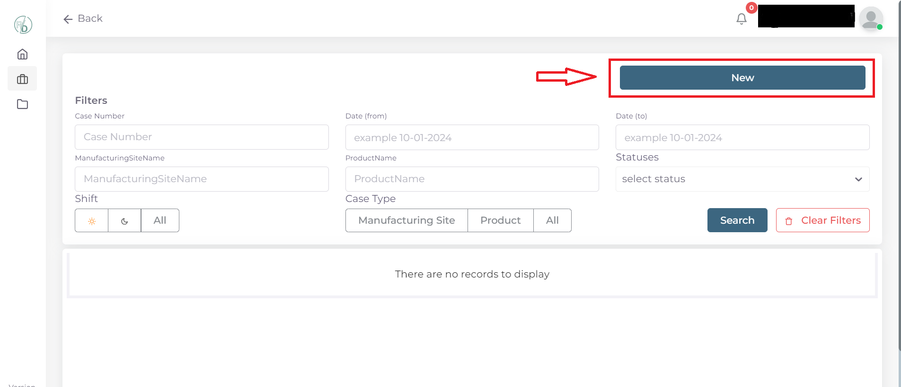

2. ثم نختار نوع المعاملات المختصة في المنتجات والمستحضرات الدوائية:

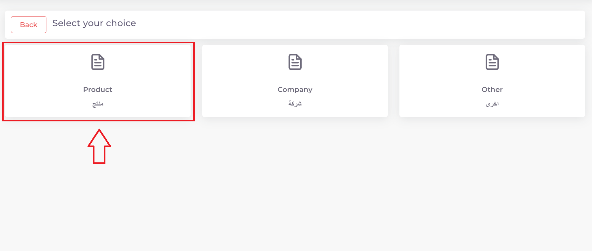

3. ثم نختار نوع المعاملة وهي تسجيل منتج او مستحضر جديد:

.. image:: ../../images/product/rigester-type.png

4. ثم نختار تخصص معاملة تسجيل المستحضر وهو تسجيل مستحضر اجنبي عادي :

.. image:: ../../images/product/sub-types-fpr.png

**ثانيا: ملئ المعلومات الاساسية للمستحضر وبدء المعاملة**:

.. image:: ../../images/product/product-info-fpr.png

.. note::
    اي حقل عليه علامة * هوة حقل اجباري ويجب ملئه للتقدم في المعاملة

    واي حقل لا يحوي هذه العلامة او يحوي على كلمة Optional فهوة حقل اختياري يمكن تركه او ملئه ولا يوثر على التقدم في المعاملة

1. اختيار وقت تدقيق المعاملة:

.. image:: ../../images/product/shift.png

2. ثم نكتب الرمز الوطني National Code الخاص بالمادة او المواد العلمية للمستحضر المراد تسجيله:

.. image:: ../../images/product/national-code.png

.. warning::
    يجب مراعاة الرموز والاحرف عند كتابة الرمز الوطني لكي يتعرف عليه النظام بنجاح

        
.. note::
    يتم الحصول على الرمز الوطني من خلال مراجعة هيئة الدواء في وزارة الصحة

3. اختيار الاسم العلمي Scientific Name:

.. image:: ../../images/product/scin-name.png

.. note::
    الخيارات في هذا الحقل تعتمد وتكون مربوطة بالرمز الوطني الذي تم ادخاله

4. اختيار شكل او طبيعة الجرعة او المستحضر Dosage Form:

.. image:: ../../images/product/d-form.png

.. note::
    الخيارات في هذا الحقل تعتمد وتكون مربوطة بالرمز الوطني الذي تم ادخاله

5. اختيار طريقة او مسار اخذ الجرعة او المستحضر Route Of Administration:

.. image:: ../../images/product/rout-admin.png

6. كتابة الاسم التجاري للمستحضر Trade Name:

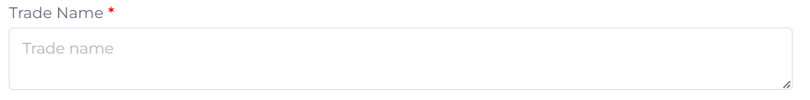

7. كتابة اسم الجهه المسئولة او المخولة لتسويق المنتج MAH وايضا اختيار دولة الجهه:

.. image:: ../../images/product/mah.png

8. ادخال حجم التعبئة للمنتج Pack Size:

.. image:: ../../images/product/pack-size.png

في حالة وجود اكثر من تعبئة واحدة لللمستحضر نضغط على زر ال Add:

.. image:: ../../images/product/pack-add.png

وفي حالة رغبة حذف احد التعبئات نضغط على ايقونة الحذف:

.. image:: ../../images/product/pack-del.png

9. اختيار درجة حرارة تخزين المستحضر Storage Temp:

.. image:: ../../images/product/temp.png

10. كتابة توجيهات الخزن Storage Direction وتوجيهات النقل Transport Direction:

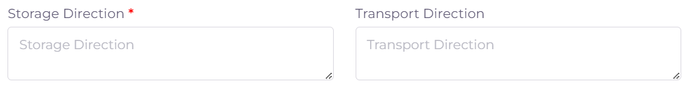

11. ادخال تفاصيل التعبئة الخاصة بالمستحضر Packiging:

.. image:: ../../images/product/packiging.png

12. ادخال نوع او مادة حاوية الدواء Container Type:

.. image:: ../../images/product/container-type.png

13. ادخال عمر الرف للمنتج Shelf life وعمر المنتج بعد الفتح In use life وهل يحوي كحول Contains alcohol:

.. image:: ../../images/product/shelf.png

14. ادخال الوصف النهائي للمستحضر Description Of Finished Product:

.. image:: ../../images/product/descrip-fin.png

15. في حالة وجود اي شهادات ساندة للمنتج فيمكن اضافتها من قسم ال Certificates:

.. image:: ../../images/product/certificate.png

16. اضافة الموقع التصنيعي للمستحضر المراد تسجيله (يجب ان يكون الموقع مسجلا ومرتبط بالمكتب العلمي):

.. image:: ../../images/product/select-manf.png

بعد اضافة موقع نختار تخصص او دور الموقع في عملية صنع المستحضر:

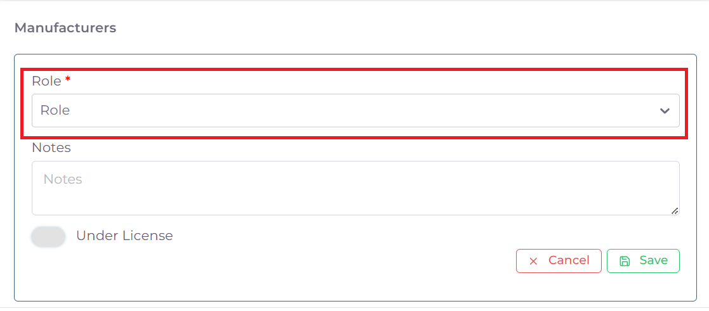

.. note::
    في حالة كان موقع تصنيعي وحيد يشارك في صنع عجينة المستحضر الاساسية وايضا عملية التغليف الاولية والثانوية بلاضافة الى التوزيع

    فيحتاج فقط اضافة موقع تصنيعي واحد مسجل عند المكتب العلمي ويكون دور المصنع هوة All.

.. warning::
    اما في حالة وجود اكثر من من موقع تصنيعي يساهم في عملية انتاج المستحضر النهائي فيجب اضافة هذة المواقع كافة وهي كالاتي:

    اذا كان الموقع التصنيعي هوة الذي يقوم بصنع عجينة او مادة المستحضر نختار Bulk Manfacture (يجب ان يكون الموقع مسجلا ومرتبط بالمكتب العلمي).

    اذا كان الموقع يقوم بالتغليف الاولي والثانوي للمستحضر فنختار Primary & Secondary Packager (يجب ان يكون الموقع مسجلا ومرتبط بالمكتب العلمي).

    اذا كان الموقع يقوم بالتغليف الاولي فقط فنختار Primary Packager (يجب ان يكون الموقع مسجلا ومرتبط بالمكتب العلمي).

    اذا كان الموقع يقوم بالتغليف الثانوي فنختار Secondary Packager (لا يحتاج الى تسجيل فقط ادخال معلومات الموقع).

    اذا كان الموقع يقوم بتوزيع المنتج فقط فنختار Batch Releaser (لا يحتاج الى تسجيل فقط ادخال معلومات الموقع).

بعد اختيار دور الموقع Role ياتي الان دور اختيار الموقع التصنيعي المربوط بحساب المكتب العلمي:

.. image:: ../../images/product/manf.png

ثم بعد اختيار الموقع التصنيعي واختيار دوره ايضا يجب الان اختيار الخط الانتاجي المسجل مسبقا للموقع المختار لغرض تسجيل المستحضر عليه.

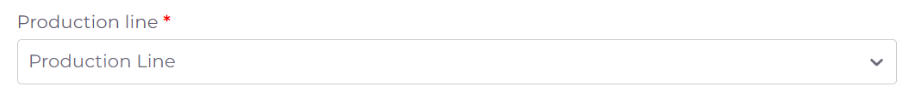

ثم نقوم بالضغط على Save لحفظ الموقع.

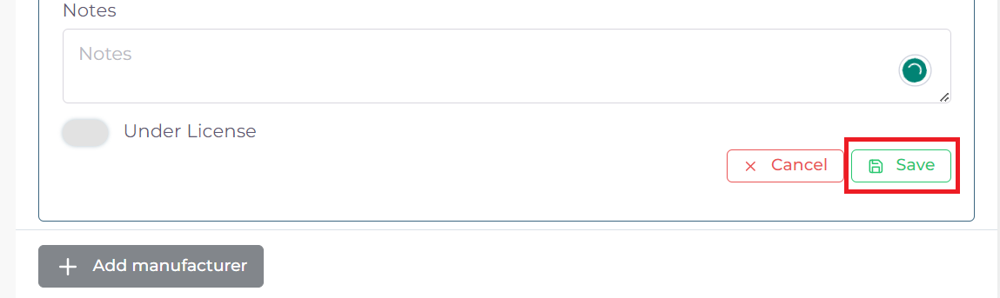

ويمكن تعديل معلومات الموقع في حالة وجود خطأ عن طريق الضغط على edit.

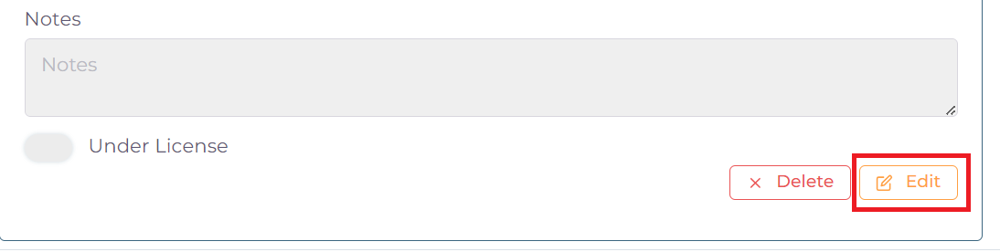

**لاضافة موقع اخر يمكن الضغط على الايقونة:**

.. image:: ../../images/product/pl-add.png

17. بعد التاكد من جميع المعلومات نعود الى بداية الصفحة ونضغط على Create لغرض بدء المعاملة:

.. image:: ../../images/product/case-create-fpr.png

18. فيتم بدء وانشاء المعاملة في النظام الالكتروني.

**ثالثا: ملئ قوائم متطلبات المعاملة Cheacklist**:

1. بعد بدء المعاملة نرى قسم قوائم المتطلبات Cheacklist على اليمين قد فتح الدخول له

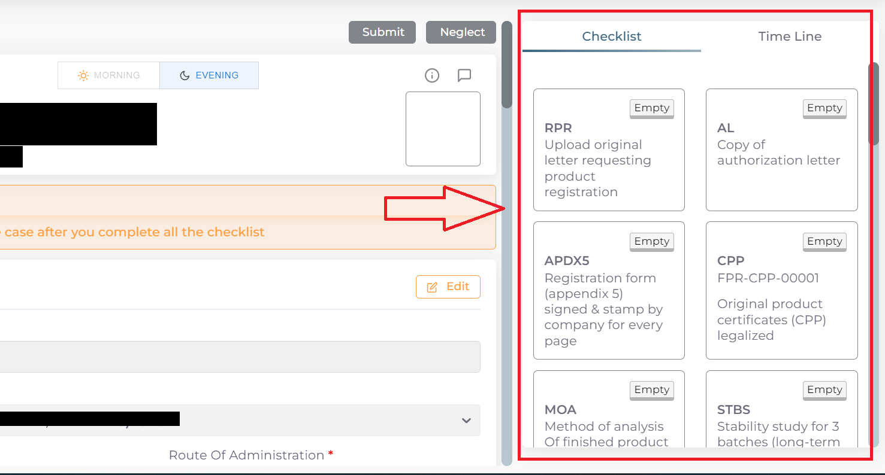

.. warning::
    قبل البدء بملئ اي Cheacklist يجب مراعاة ما يلي:

    1. ملئ الحقول المطلوبة ان وجدت

    2. يجب رفع الملف الخاص في ال Cheacklist بصيغة pdf

    3. ان يكون الملف المقدم يحوي فقط اوراق الملف المخصصة لل Cheacklist

**كيفية ملئ الحقول ورفع الملفات لل Cheacklist وطريقة حفظ التقدم**:

* نضغط على احد المتطلبات للبدء بملؤها وتشمل المتطلبات :

1. رسالة التخويل Authorization letter: ويجب ان تكون نسخة مصدقة وقانونية صادرة من دولة الموقع التصنيعي.

**A) ملئ حقول ال Checklist:**

.. note::
    اي حقل يحوي على علامة * فهو حقل يجب ملؤه

    اما اذا لم يحوي على العلامة او كان يحوي على كلمة Optional فهو حقل اختياري

**وتشمل الحقول:**

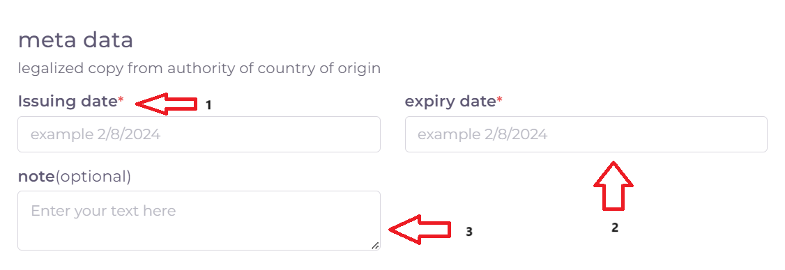

1. تاريخ اصدار رسالة التخويل Issuing Date.

2. تاريخ انتهاء رسالة التخويل Expiry Date.

3. حقل ملاحظات اختياري Note.

ثم نقوم بحفظ معلومات الحقول بعد ملئ كل الحقول المطلوبة عن طريق الضغط على زر Save Info في بداية الصفحة:

    .. image:: ../../images/company/field.png

في حالة حدوث خطأ في ادخال المعلومات وتم حفظ التقدم فيمكن التعديل على الحقول عن طريق الضغط على Edit:

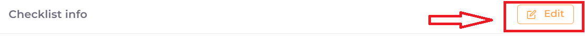
    
ثم تغيير الحقول المطلوبة والضغط على Save Info لحفظ التغييرات الجديدة او الضغط على Cancel لتجاهل التغييرات

.. image:: ../images/company/cancel-save.png

**B) رفع الملف (ويجب ان يكون بصيغة pdf)**:
  

1. لكي نقوم برفع الملف الخاص بهذة القائمة نقوم بالنزول لقسم Attachments في اخر الصفحة :

    .. image:: ../../images/company/attach.png

2. نقوم بالضغط على ايقونة الرفع واختيار ملف للرفع (يجب ان يكون الملف بصيغة pdf):

    .. image:: ../../images/company/upload.png

3. ويضهر الملف بعد رفعه كما موضح ادناه:

    .. image:: ../../images/company/upload-show.png

في حالة رغبتك بالتاكد من الملف فيمكنك:

.. image:: ../../images/company/folder-icon.png

عرض الملف المرفوع عن طريق الضغط على الايقونة رقم 1.
         
واذا اردت تنزيل الملف نضغط على الايقونة رقم 2 .
         
واذا اردت حذف الملف فنضغط على الايقونة رقم 3 (لا يمكن تعديل او حذف الملف بعد ارسال المعاملة).
         
واذا اردت اضافة ملاحظة حول الملف نضغط الايقونة رقم 4.

.. raw:: html

    

         
**C) حفظ ال Cheacklist**

بعد رفع الملف وملئ الحقول ان وجدت نعود الى بداية الصفحة ونضغط على save لغرض حفظ ال cheacklist :

.. image:: ../../images/company/save-chck.png

.. raw:: html

    

**رابعا) التاكد من المعلومات وارسال المعاملة:**

1. بعد ملئ كافة ال Cheacklist وتحول الحالة الى  Draft يمكن الان ارسال المعاملة وعمل Submit.

.. warning::
    لا يمكن تعديل اي حقول او ملفات بعد ارسال المعاملة لذلك يرجى التاكد جيدا قبل الارسال.
    وفي حال حدوث اي خطأ يرجى التواصل مع قسم الدعم الفني لتلقي المساعدة اللازمة

2. نضغط على زر Submit  في واجهه المعاملة الرئيسية لغرض ارسال المعاملة:

.. image:: ../../images/company/submit.png

.. warning::
    في حالة وجود خطأ في اختيار نوع المعاملة او شيئ مشابه يمكن اهمال المعاملة الحالية عن طريق الضغط على زر Neglect.

3. لتاكيد عملية الارسال نرى حالة المعاملة الرئيسية وحالة كل Cheaklist  قد تحولت الى Submitted اي تم الارسال بنجاح.

.. image:: ../../images/company/f-submit.png

4. بعد الانتهاء من الارسال يجب مراجعة وزارة الصحة/ دائرة الامور الفنية/ قسم التسجيل  مع جلب الملفات المصدقة والاصلية المطلوبة وايضا لدفع فاتورة الاستمارة الالكترونية.

